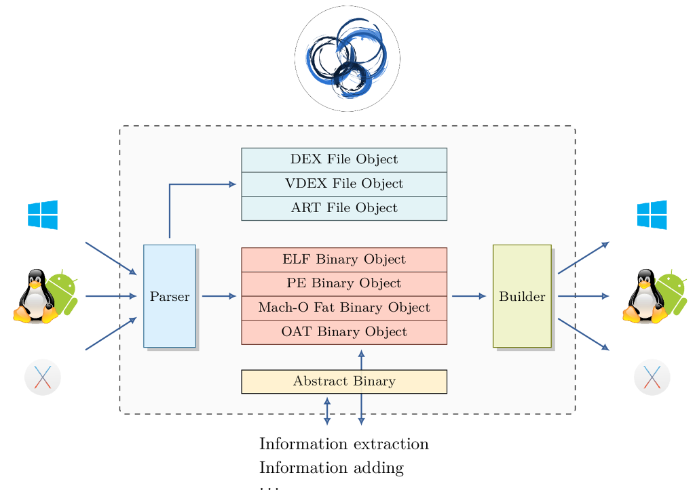

Introduction
============

The purpose of this project is to provide a cross platform library which can parse, modify and abstract ``ELF``, ``PE`` and ``MachO`` formats.

Main features:

  * Parser: LIEF can parse ``ELF``, ``PE``, ``MachO``. Moreover it provides a user-friendly API to access to format internals.
  * Modify: LIEF enables to modify **some** parts of these formats
  * Abstract: Three formats have common features like sections, symbols, entry point... LIEF factors them.
  * API: LIEF can be used in C, C++ and Python

The global architecture looks like this:

|

In the architecture, each format has its own *namespace*, parser and builder.
The parser takes a binary, library... as input and decomposes in LIEF object.
For instance, the ``ELF``  format has segments, so ``ELF::Parser`` will parse segments to create ``ELF::Segment``. In the ``ELF::Binary`` class we will have a list of ``ELF::Segment`` which can be modified (change type, size, content...). Then the ``ELF::Builder`` will transform ``ELF::Binary`` into a valid executable.

This process can be summed up in the following figure:

.. image:: _static/archi_elf.png
   :height: 700px
   :alt: alternate text
   :align: center

|

