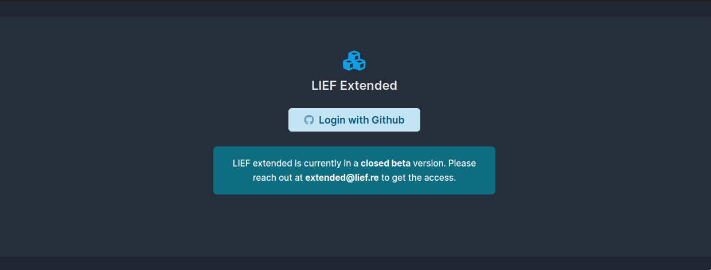

.. _extended-intro:

:fa:`cubes` What is LIEF Extended?
----------------------------------

*LIEF extended* is an enhanced version of LIEF that contains additional features
like the support of Objective-C metadata, PDB and DWARF.

Whilst the main version of LIEF is focused on (only) providing the support for
ELF, PE, and Mach-O, LIEF extended aims at providing other functionalities that
were not originally designed to be integrated in LIEF.

You can find the differences between both versions in this table:

+--------+-------------------+-------------------+---------------------------------------------------------------------+
| Module | Regular Version   | Extended Version  | Note                                                                |
+========+===================+===================+=====================================================================+
| ELF    | :fa-check:`check` | :fa-check:`check` |                                                                     |
+--------+-------------------+-------------------+---------------------------------------------------------------------+
| PE     | :fa-check:`check` | :fa-check:`check` |                                                                     |
+--------+-------------------+-------------------+---------------------------------------------------------------------+
| Mach-O | :fa-check:`check` | :fa-check:`check` |                                                                     |
+--------+-------------------+-------------------+---------------------------------------------------------------------+
| DEX    | :fa-check:`check` | :fa-check:`check` |                                                                     |
+--------+-------------------+-------------------+---------------------------------------------------------------------+
| OAT    | :fa-check:`check` | :fa-check:`check` |                                                                     |
+--------+-------------------+-------------------+---------------------------------------------------------------------+
| VDEX   | :fa-check:`check` | :fa-check:`check` |                                                                     |
+--------+-------------------+-------------------+---------------------------------------------------------------------+
| ART    | :fa-check:`check` | :fa-check:`check` |                                                                     |
+--------+-------------------+-------------------+---------------------------------------------------------------------+
| PDB    | :xmark:`mark`     | :fa-check:`check` | Support based on LLVM                                               |
+--------+-------------------+-------------------+---------------------------------------------------------------------+
| DWARF  | :xmark:`mark`     | :fa-check:`check` | Support based on LLVM                                               |
+--------+-------------------+-------------------+---------------------------------------------------------------------+
| ObjC   | :xmark:`mark`     | :fa-check:`check` | Support based on `iCDump <https://github.com/romainthomas/iCDump>`_ |
+--------+-------------------+-------------------+---------------------------------------------------------------------+

To access the extended version, you must oauth-login with GitHub here: https://extended.lief.re/.

|

.. warning::

  LIEF extended is currently in a closed-beta state, please first reach out at
  extended@lief.re to get the access.

Once logged in, you can download the package of your choice
(e.g. LIEF Extended - Python 3.10 for macOS arm64)

.. note::

  There is a delay between each download.
