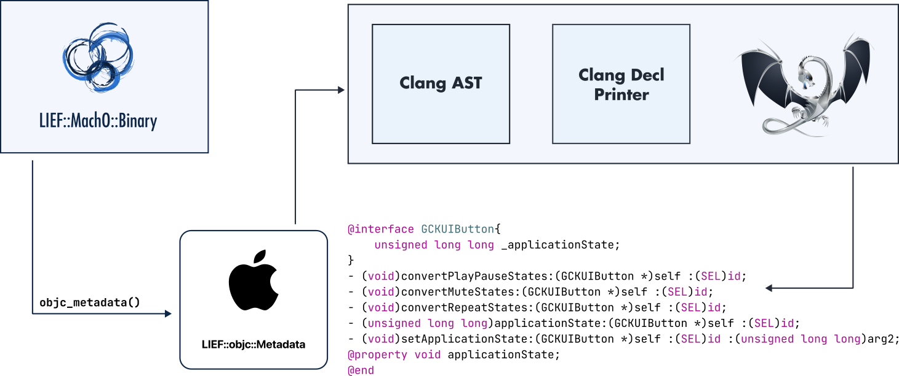

.. _extended-objc:

:fa:`brands fa-apple` Objective-C
---------------------------------

.. toctree::
  :caption: <i class="fa-solid fa-code">&nbsp;</i>API
  :maxdepth: 2

  cpp
  python
  rust

----

Introduction
************

This module allows to inspect Objective-C metadata from a Mach-O binary.

If a Mach-O binary embeds Objective-C metadata, they can be accessed through
|lief-macho-binary-objc-metadata|:

.. tabs::

  .. tab:: :fa:`brands fa-python` Python

      .. code-block:: python

        macho: lief.MachO.Binary = ...
        metadata: lief.objc.Metadata = macho.objc_metadata
        if metadata is not None:
            print("Objective-C metadata found")

  .. tab:: :fa:`regular fa-file-code` C++

      .. code-block:: cpp

        std::unique_ptr<LIEF::MachO::Binary> macho;
        std::unique_ptr<LIEF::objc::Metadata> metadata = macho->objc_metadata();

        if (metadata != nullptr) {
          std::cout << "Objective metadata found\n";
        }

  .. tab:: :fa:`brands fa-rust` Rust

      .. code-block:: rust

        let macho: lief::macho::Binary;

        if let Some(metadata) = macho.objc_metadata() {
            println!("Objective-C metadata found");
        }

Then at this point, one can use the API exposed by the class |lief-objc-metadata|
to inspect the Objective-C Metadata.

In particular, the function: |lief-objc-metadata-to_decl| can be used to generate
a header-like output of all the Objective-C metadata found in the binary.

.. tabs::

  .. tab:: :fa:`brands fa-python` Python

      .. code-block:: python

        macho: lief.MachO.Binary = lief.parse("some_macho")
        metadata: lief.objc.Metadata = macho.objc_metadata
        for clazz in metadata.classes:
            print(f"name={clazz.name}")
            for meth in clazz.methods:
                print(f"  method.name={meth.name}")
        print(metadata.to_decl())

  .. tab:: :fa:`regular fa-file-code` C++

      .. code-block:: cpp

        std::unique_ptr<LIEF::MachO::FatBinary> fat = LIEF::MachO::Parser::parse(argv[1]);
        LIEF::MachO::Binary* bin = fat->at(0);

        std::unique_ptr<LIEF::objc::Metadata> metadata = bin->objc_metadata();

        for (const std::unique_ptr<LIEF::objc::Class>& clazz : metadata->classes()) {
          log(LOG_LVL, "name={}", clazz->name());
          for (const std::unique_ptr<LIEF::objc::Method>& meth : clazz->methods()) {
            log(LOG_LVL, "  method.name={}", meth->name());
          }
        }

        log(LOG_LVL, metadata->to_decl());

  .. tab:: :fa:`brands fa-rust` Rust

    .. code-block:: rust

        let Some(lief::Binary::MachO(fat)) = lief::Binary::parse(&path) else { process::exit(1); };
        let Some(bin) = fat.iter().next() else { process::exit(1); };
        let Some(metadata) = bin.objc_metadata() else { process::exit(1); };

        for class in metadata.classes() {
            println!("name={}", class.name());
            for method in class.methods() {
                println!("  method.name={}", method.name());
            }
        }
        println!("{}", metadata.to_decl());

Class Dump
**********

When doing binary analysis it can useful to generate header-like information
to get a global overview of the different structures present in the objective-c
metadata.

LIEF provides a way to generate this header like information at different levels:

- |lief-objc-metadata-to_decl_opt|
- |lief-objc-class-to_decl_opt|
- |lief-objc-proto-to_decl_opt|

From a technical standpoint, this output is generated by generating a Clang AST
and by applying the LLVM's printer visitor on this AST.

.. tabs::

  .. tab:: :fa:`brands fa-rust` Code

    .. code-block:: rust

      fn classdump(macho: &lief::macho::Binary) {
        let metadata = macho.objc_metadata().expect("Missing Objective-C info");
        for class in metadata.classes() {
          println!("{}", class.to_decl());
        }
      }

  .. tab:: :fa:`solid fa-terminal` Result

    .. code-block:: objc

      @interface APMEventFilter<APMAudienceFilter> {
          bool _sessionScoped;
          bool _dynamic;
          bool _sequence;
          int _audienceID;
          int _filterID;
          NSString * _eventName;
          NSData * _data;
      }
      // Address: 0x0101859ee0
      - (NSObject *)initWithAudienceID:(APMEventFilter *)self filterID:(SEL)id eventName:(int)arg2 data:(int)arg3 sessionScoped:(NSObject *)arg4 dynamic:(NSObject *)arg5 sequence:(bool)arg6 :(bool)arg7 :(bool)arg8;
      // Address: 0x0101682590
      - (int)audienceID:(APMEventFilter *)self :(SEL)id;
      // Address: 0x01017b6d98
      - (int)filterID:(APMEventFilter *)self :(SEL)id;
      // Address: 0x01018a4a6c
      - (bool)isSessionScoped:(APMEventFilter *)self :(SEL)id;
      // Address: 0x01017630d4
      - (bool)isDynamic:(APMEventFilter *)self :(SEL)id;
      // Address: 0x01016adbb4
      - (bool)isSequence:(APMEventFilter *)self :(SEL)id;
      // Address: 0x010187a5f8
      - (NSObject *)eventName:(APMEventFilter *)self :(SEL)id;
      // Address: 0x0101581bfc
      - (NSObject *)data:(APMEventFilter *)self :(SEL)id;
      // Address: 0x01018e1f3c
      - (void).cxx_destruct:(APMEventFilter *)self :(SEL)id;
      @property void eventName;
      @property void data;
      @property void audienceID;
      @property void filterID;
      @property void sessionScoped;
      @property void dynamic;
      @property void sequence;
      @property void hash;
      @property void superclass;
      @property void description;
      @property void debugDescription;
      @end

The |lief-objc-declopt| can be used to tweak the generated output. For instance,
we can remove the commented address associated with the objective-c method with
this option:

.. code-block:: python

  def print_without_address(macho: lief.MachO.Binary):

      metadata = macho.objc_metadata

      config = lief.objc.DeclOpt()
      config.show_annotations = False

      for cls in metadata.classes:
          print(cls.to_decl(config))

:fa:`solid fa-book-open-reader` References
*******************************************

- :github-ref:`romainthomas/iCDump`
- :github-ref:`nygard/class-dump`
- https://www.romainthomas.fr/post/23-01-icdump/

API
****

You can find the documentation of the API for the different languages here:

:fa:`brands fa-python` :doc:`Python API <python>`

:fa:`regular fa-file-code` :doc:`C++ API <cpp>`

:fa:`brands fa-rust` Rust API: :rust:module:`lief::objc`

.. include:: ../../_cross_api.rst
