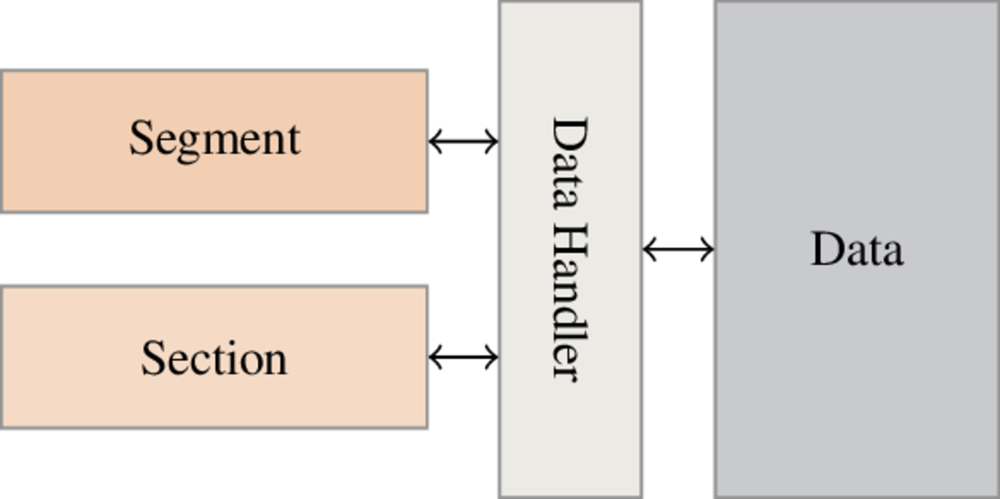

ELF Format
==========

Duality sections/segments
--------------------------

In the ``ELF`` format there are two kinds of containers for handling data:

  * Sections
  * Segments

A first sight it's a bit disturbing because it's two representations of the same data. In fact these two representations are used differently.

**Sections** are usually used at **link** time by the linker (e.g. ``/bin/ld``) whereas **segments** are usually used at **load** time by kernel and loader (e.g. ``/lib/ld-linux.so``).

Sections header table is not mandatory so you can execute an ELF binary without sections header table. Let's take an example:

.. code-block:: console

  $ readelf -Sh /bin/ls
  ELF Header:
    Magic:   7f 45 4c 46 02 01 01 00 00 00 00 00 00 00 00 00
    Class:                             ELF64
    Data:                              2's complement, little endian
    Version:                           1 (current)
    OS/ABI:                            UNIX - System V
    ABI Version:                       0
    Type:                              EXEC (Executable file)
    Machine:                           Advanced Micro Devices X86-64
    Version:                           0x1
    Entry point address:               0x4022f0
    Start of program headers:          64 (bytes into file)
    Start of section headers:          37840 (bytes into file)
    Flags:                             0x0
    Size of this header:               64 (bytes)
    Size of program headers:           56 (bytes)
    Number of program headers:         9
    Size of section headers:           64 (bytes)
    Number of section headers:         28
    Section header string table index: 27

  Section Headers:
    [Nr] Name              Type             Address           Offset
         Size              EntSize          Flags  Link  Info  Align
    [ 0]                   NULL             0000000000000000  00000000
         0000000000000000  0000000000000000           0     0     0
    [ 1] .interp           PROGBITS         0000000000400238  00000238
         000000000000001c  0000000000000000   A       0     0     1
    [ 2] .note.ABI-tag     NOTE             0000000000400254  00000254
         0000000000000020  0000000000000000   A       0     0     4
    [ 3] .note.gnu.build-i NOTE             0000000000400274  00000274
         0000000000000024  0000000000000000   A       0     0     4
    [ 4] .gnu.hash         GNU_HASH         0000000000400298  00000298
         0000000000000060  0000000000000000   A       5     0     8
    [ 5] .dynsym           DYNSYM           00000000004002f8  000002f8
         00000000000006d8  0000000000000018   A       6     1     8
    [ 6] .dynstr           STRTAB           00000000004009d0  000009d0
         00000000000002f1  0000000000000000   A       0     0     1
    [ 7] .gnu.version      VERSYM           0000000000400cc2  00000cc2
         0000000000000092  0000000000000002   A       5     0     2
   ...

    [27] .shstrtab         STRTAB           0000000000000000  000092d6
         00000000000000f8  0000000000000000           0     0     1
  Key to Flags:
    W (write), A (alloc), X (execute), M (merge), S (strings), l (large)
    I (info), L (link order), G (group), T (TLS), E (exclude), x (unknown)
    O (extra OS processing required) o (OS specific), p (processor specific)

Now we remove sections header with **LIEF**:

.. code-block:: python

  from lief import ELF
  binary  = ELF.Parse("/bin/ls") # Build an ELF binary
  header = binary.header
  header.section_header_offset    = 0;
  header numberof_section_headers = 0;
  binary.write("out.bin");

Now if we run ``out.bin``:

.. code-block:: console

  $ ./out.bin
  elf_reader.py	  elf_remove_section_table.py  library_symbols_obfuscation  out.bin
  elf_rebuilder.py  elf_symbol_obfuscation.py    nm.py			    pe_reader.py

We can check that sections header table has been removed:

.. code-block:: console

  $ readelf -Sh ./out.bin
  ELF Header:
    Magic:   7f 45 4c 46 02 01 01 00 00 00 00 00 00 00 00 00
    Class:                             ELF64
    Data:                              2's complement, little endian
    Version:                           1 (current)
    OS/ABI:                            UNIX - System V
    ABI Version:                       0
    Type:                              EXEC (Executable file)
    Machine:                           Advanced Micro Devices X86-64
    Version:                           0x1
    Entry point address:               0x4022f0
    Start of program headers:          64 (bytes into file)
    Start of section headers:          0 (bytes into file)
    Flags:                             0x0
    Size of this header:               64 (bytes)
    Size of program headers:           56 (bytes)
    Number of program headers:         9
    Size of section headers:           64 (bytes)
    Number of section headers:         0
    Section header string table index: 27 <corrupt: out of range>

  There are no sections in this file.

As content can be used and updated by both sections and segments we can't store it in sections/segments. Instead we use an interface to manage content. The manager interface looks like this:

|

|

The manager is implemented in the ``ELF::DataHandler::Handler`` class.

