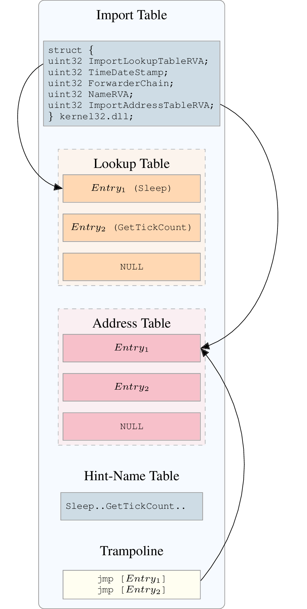

PE Format
=========

In this part we won't describe PE format totally but some parts that are tricky.

Rebuilding Import Table
-----------------------

When a PE binary uses external library, it usually has an import table stored in the .idata section. This table has the following structure:

|

.. image:: ../_static/iat4.png
   :width: 465px
   :height: 800px
   :scale: 70%
   :alt: alternate text
   :align: center

|

The lookup table holds offset to imported function's name. In the example, we import functions `Sleep` and `GetTickCount` from the `kernel32.dll`.

The address table is identical (in most cases) to the lookup table but at runtime it will hold the imported function's address. The first entry will hold the address of `Sleep` and the second one the address of `GetTickCount`.

If the program need to call `Sleep` function the assembly code should look like this:

.. code-block:: nasm

  call address_table[entry1] ; call to sleep

When rebuilding binary in ``LIEF`` we don't patch at any moment the assembly code which is a strong constraint for rebuilding import table. As we don't know exact structure of import table in the original binary (address table could be before lookup table...).
`
The reconstructed import table is built in another section named ``.idata``. To keep a consistent binary we patch the original binary in the following way:

Each entry in the address table is replaced with the address of the entry in the trampoline section. (see figure 2)

|

|

So if we have a call to an imported function we will have the following sequence of instructions:

.. code-block:: nasm

  call address_table_original[entry1] ; call to trampoline[0]
  jmp *address_table[entry1]          ; jump to Sleep address
