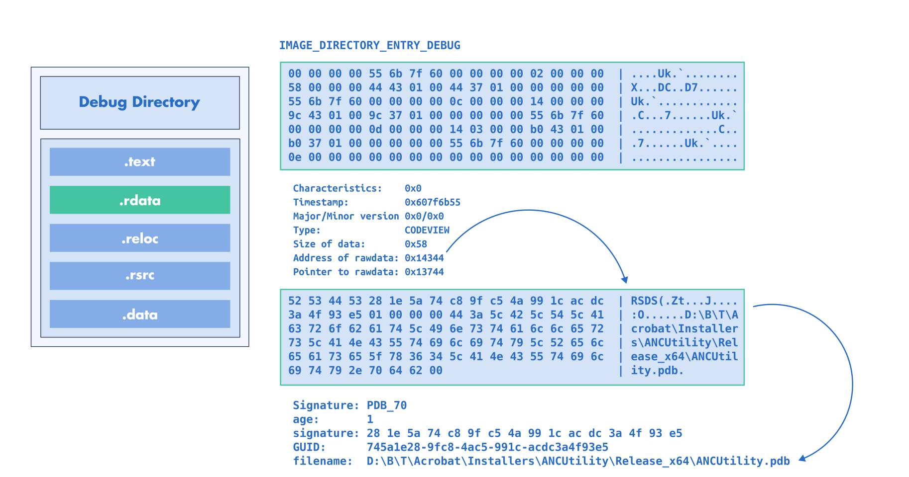

.. _pe_debug_modification:

:fa:`solid fa-gears` Debug Modification
---------------------------------------

LIEF can create, modify, or delete PE debug information entries.

These debug information are located in the ``IMAGE_DIRECTORY_ENTRY_DEBUG`` and
are represented in LIEF through the |lief-pe-debug| class.

We can modify these entries by using the API exposed from these structures.
For instance, we can change the PDB path referenced in a |lief-pe-codeviewpdb|
entry as follows:

.. tabs::

  .. tab:: :fa:`brands fa-python` Python

      .. code-block:: python

        import lief

        pe: lief.PE.Binary = ...

        pe.codeview_pdb.filename = r"C:\A\B\C\path.pdb"

        pe.write("out.dll")

  .. tab:: :fa:`regular fa-file-code` C++

      .. code-block:: cpp

        #include <LIEF/PE.hpp>

        std::unique_ptr<LIEF::PE::Binary> pe;

        pe->codeview_pdb("C:\\A\\B\\C\\path.pdb");

        pe->write("out.dll");

  .. tab:: :fa:`brands fa-rust` Rust

      .. code-block:: rust

        let mut pe: lief::pe::Binary;

        pe.codeview_pdb().unwrap().set_filename(r#"C:\A\B\C\path.pdb"#);

        pe.write("out.exe");

The function |lief-pe-binary-remove-debug| can be used to remove a specific
entry while the function |lief-pe-binary-clear-debug| removes **all** the debug
entries:

.. tabs::

  .. tab:: :fa:`brands fa-python` Python

      .. code-block:: python

        import lief

        pe: lief.PE.Binary = ...

        # Remove a single CodeViewPDB entry
        pe.remove_debug(pe.codeview_pdb)

        # Remove all entries
        pe.clear_debug()

        pe.write("out.dll")

  .. tab:: :fa:`regular fa-file-code` C++

      .. code-block:: cpp

        #include <LIEF/PE.hpp>

        std::unique_ptr<LIEF::PE::Binary> pe;

        // Remove a single CodeViewPDB entry
        pe->remove_debug(*pe->codeview_pdb());

        // Remove all entries
        pe->clear_debug();

        pe->write("out.dll");

  .. tab:: :fa:`brands fa-rust` Rust

      .. code-block:: rust

        let mut pe: lief::pe::Binary;

        // Remove a single CodeViewPDB entry
        pe.remove_debug(pe.codeview_pdb().unwrap());

        // Remove all entries
        pe.clear_debug();

        pe.write("out.exe");

Finally, |lief-pe-binary-add-debug-info| can be used to add a crafted debug
entry in an existing PE.

For instance, we can create a custom |lief-pe-codeviewpdb| as follows:

.. tabs::

  .. tab:: :fa:`brands fa-python` Python

      .. code-block:: python

        import lief

        pe: lief.PE.Binary = ...

        cv = lief.PE.CodeViewPDB("MyCustom.pdb")

        pe.add_debug_info(cv)

        pe.write("out.dll")

  .. tab:: :fa:`regular fa-file-code` C++

      .. code-block:: cpp

        #include <LIEF/PE.hpp>

        std::unique_ptr<LIEF::PE::Binary> pe;

        LIEF::PE::CodeViewPDB cv("MyCustom.pdb");
        pe->add_debug_info(cv);

        pe->write("out.dll");

  .. tab:: :fa:`brands fa-rust` Rust

      .. code-block:: rust

        let mut pe: lief::pe::Binary;

        let cv = lief::pe::debug::CodeViewPDB::with_filename("MyCustom.pdb");

        pe.add_debug_info(&cv);

        pe.write("out.exe");

.. include:: ../../../_cross_api.rst
