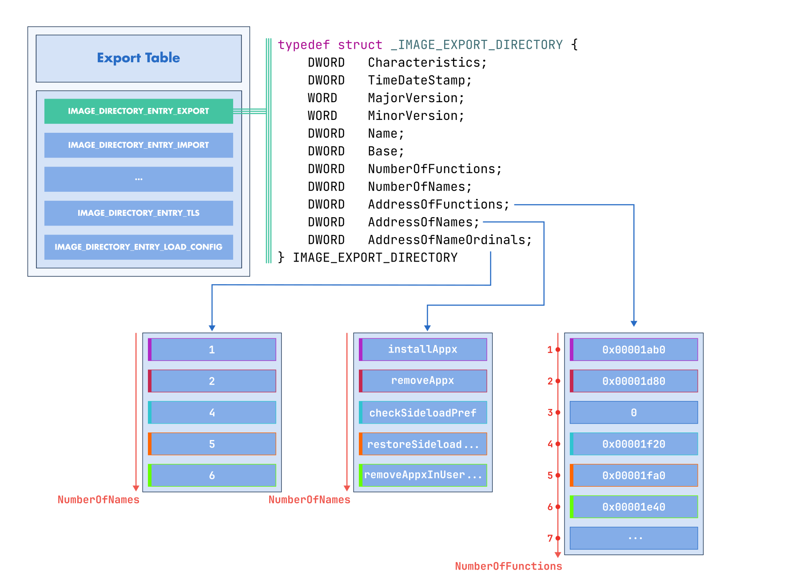

:fa:`solid fa-gears` Exports Modification
-----------------------------------------

LIEF provides extensive support for modifying the PE's export table giving you the
ability to add, remove, or modify export entries or to create the entire export
table in a PE Binary.

In any case, this support requires enabling the |lief-pe-builder-config-exports|
as the modified export table is **relocated** in a **new** section. The
section's name can be controlled with |lief-pe-builder-config-export_section|.

Creating Export Entries
~~~~~~~~~~~~~~~~~~~~~~~

Creating a |lief-pe-export-entry| can be useful for exposing a "hidden" function
based on its address and to leverage its functionality as a regular linker-generated export.

This could be used for code lifting or fuzzing.

.. tabs::

  .. tab:: :fa:`brands fa-python` Python

      .. code-block:: python

        import lief

        pe: lief.PE.Binary = ...

        exp: lief.PE.Export = pe.get_export()

        # Remove an entry
        exp.remove_entry("my_exported_name")

        # Add a new export
        exp.add_entry("fuzz_me", 0x10010)

        config = lief.PE.Builder.config_t()
        config.exports = True
        config.export_section = ".myedata" # optional

        pe.write("out.dll", config)

  .. tab:: :fa:`regular fa-file-code` C++

      .. code-block:: cpp

        #include <LIEF/PE.hpp>

        std::unique_ptr<LIEF::PE::Binary> pe;

        LIEF::PE::Export* exp = pe->get_export();

        // Remove an entry
        exp->remove_entry("my_exported_name");

        // Add a new export
        exp->add_entry("fuzz_me", 0x10010);

        LIEF::PE::Builder::config_t config();
        config.exports = true;
        config.export_section = ".myedata";

        pe->write("out.dll", config);

  .. tab:: :fa:`brands fa-rust` Rust

      .. code-block:: rust

        let mut pe: lief::pe::Binary;

        let mut exp: lief::pe::Export = pe.export().unwrap();

        // Remove an entry
        exp.remove_entry_by_name("my_exported_name");

        // Add a new export
        exp.add_entry_by_name("fuzz_me", 0x10010);

        let mut config = lief::pe::builder::Config::default();
        config.exports = true;
        config.export_section = true;

        pe.write_with_config("out.dll", config);

Creating an Export Table
~~~~~~~~~~~~~~~~~~~~~~~~

This section introduces the API for creating an export table. We'll explore a
scenario where we want to convert a PE executable into a DLL.

.. note::

  The process of converting an executable to a library is also detailed for ELF
  binary in the tutorial: :ref:`tuto_elf_bin2lib`.

First, we need to update PE headers to ensure they are compliant with the DLL
format:

.. tabs::

  .. tab:: :fa:`brands fa-python` Python

      .. code-block:: python

        import lief

        pe: lief.PE.Binary = ...

        pe.header.add_characteristic(lief.PE.Header.CHARACTERISTICS.DLL)
        pe.optional_header.addressof_entrypoint = 0

  .. tab:: :fa:`regular fa-file-code` C++

      .. code-block:: cpp

        #include <LIEF/PE.hpp>

        std::unique_ptr<LIEF::PE::Binary> pe;

        pe->header().add_characteristic(LIEF::PE::Header::CHARACTERISTICS::DLL);
        pe->optional_header().addressof_entrypoint(0);

  .. tab:: :fa:`brands fa-rust` Rust

      .. code-block:: rust

        let mut pe: lief::pe::Binary;

        pe.header().add_characteristic(lief::pe::headers::Characteristics::DLL);
        pe.optional_header().set_addressof_entrypoint(0);

Then, we can start creating and filling a new Export Table:

.. tabs::

  .. tab:: :fa:`brands fa-python` Python

      .. code-block:: python

        exp = lief.PE.Export("lib_exe2dll.dll", [
            lief.PE.ExportEntry("cbk1", 0x0001000),
            lief.PE.ExportEntry("cbk2", 0x0001010),
        ])

        pe.set_export(exp)

        config = lief.PE.Builder.config_t()
        config.exports = True

        pe.write("lib_exe2dll.dll")

  .. tab:: :fa:`regular fa-file-code` C++

      .. code-block:: cpp

        LIEF::PE::Export exp("lib_exe2dll.dll",
          {
            LIEF::PE::ExportEntry("cbk1", 0x0001000),
            LIEF::PE::ExportEntry("cbk2", 0x0001010),
          }
        );

        pe->set_export(exp)

        LIEF::PE::Builder::config_t config();
        config.exports = true;

        pe->write("lib_exe2dll.dll", config);

  .. tab:: :fa:`brands fa-rust` Rust

      .. code-block:: rust

        let mut exp = lief::pe::Export::new();

        exp.set_name("lib_exe2dll.dll");
        exp.add_entry_by_name("cbk1", 0x0001000);
        exp.add_entry_by_name("cbk2", 0x0001010);

        pe.set_export(&exp);

        pe.write_with_config("lib_exe2dll.dll", config);

.. admonition:: Limitations
  :class: tip

  This binary-to-library example assumes that the original executable has been
  compiled to be position-independent which means that it contains relocations.

Within a Python environment, we can check that ``lib_exe2dll.dll``  can be
loaded as a DLL and that we can call ``cbk1`` and ``cbk2``:

.. code-block:: python

  import ctypes

  lib = ctypes.windll.LoadLibrary("lib_exe2dll.dll")

  assert lib.cbk1() >= 0
  assert lib.cbk2() >= 0

.. include:: ../../../_cross_api.rst
