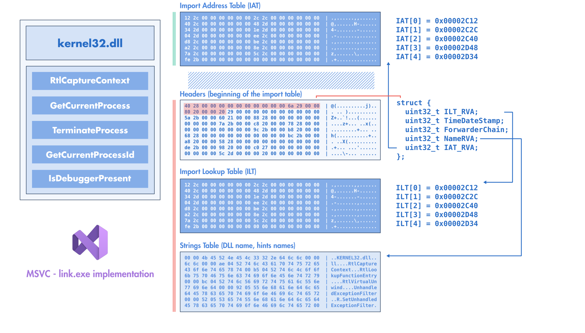
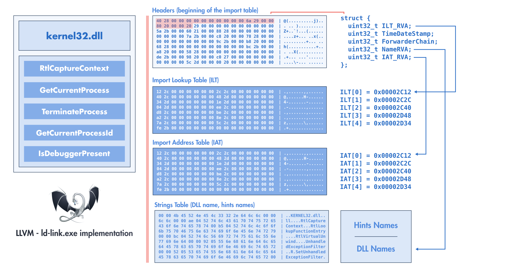
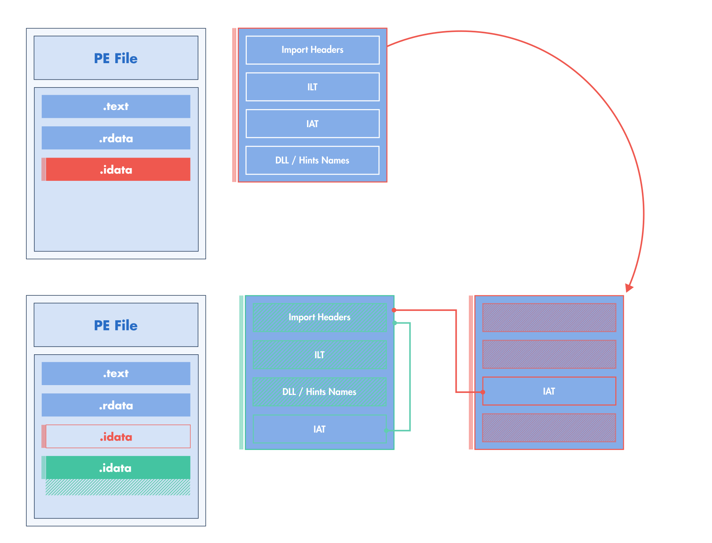

:fa:`solid fa-gears` Imports Modification
------------------------------------------

This section describes the different operations supported by LIEF to modify the
PE import table. Please note that any operation not mentioned in this
page can be considered as not supported or might lead to a corrupted
binary.

+--------------------------------------------------------------+-------------------+
| Operation                                                    | Supported         |
+==============================================================+===================+
| :ref:`Add new import <ref-add-imp>`                          | :fa-check:`check` |
+--------------------------------------------------------------+-------------------+
| :ref:`Add an imported function <ref-add-imp-func>`           | :fa-check:`check` |
+--------------------------------------------------------------+-------------------+
| :ref:`Remove an import <ref-remove-import>`                  | :fa-check:`check` |
+--------------------------------------------------------------+-------------------+
| :ref:`Remove an imported function <ref-remove-import-entry>` | :fa-check:`check` |
+--------------------------------------------------------------+-------------------+
| Extend original IAT                                          | :xmark:`mark`     |
+--------------------------------------------------------------+-------------------+
| Extend original ILT                                          | :fa-check:`check` |
+--------------------------------------------------------------+-------------------+

.. admonition:: Implementation Update
  :class: note

  Compared to the previous of LIEF, the import table modification has been
  completely redesigned to be more reliable when modifying or rebuilding
  a PE binary.

.. _ref-imp-mod-intro:

Introduction
************

Modifying the PE import table generically and reliably can be challenging
due to its flexible layout and strong dependency on the assembly
code.
To better understand these challenges and how they are addressed in LIEF,
let's start with the layout of the import table generated by the MSVC linker
(``link.exe``):

.. _fig-msvc-layout:

  Import Table Layout (``MSVC/link.exe``)

First off, the import table is referenced by the |lief-pe-datadirectory|
indexed by the ``IMPORT_TABLE`` value.
The RVA of this data directory points to the beginning of the raw structure
describing the import table while the data directory's size provides the length
of this table.
For each imported library (e.g. ``kernel32.dll``), the import header references
3 locations:

1. Address (RVA) of the import **lookup** table (**ILT**)
2. RVA of the imported library name (e.g. RVA of the string ``kernel32.dll``)
3. Address (RVA) of the import **address** table (**IAT**)

The IAT and the ILT point to an array of integers (pointer width) ending with a
zero. In the on-disk PE binary, both tables are filled with an RVA referencing
the imported function name (or an ordinal value).

For instance, if the binary imports ``kernel32.dll!GetCurrentProcess`` and
``kernel32.dll!TerminateProcess`` then we would have the following ILT/IAT:

.. code-block:: cpp

   uintptr_t IAT[3] = {
      RVA("GetCurrentProcess"),
      RVA("TerminateProcess"),
      0
   };

   uintptr_t ILT[3] = {
      RVA("GetCurrentProcess"),
      RVA("TerminateProcess"),
      0
   };

When Windows loads the binary and resolves its imports, it fills the **IAT**
with the **resolved address** of the imported functions:

.. code-block:: diff

      uintptr_t IAT[3] = {
    -   RVA("GetCurrentProcess"),
    -   RVA("TerminateProcess"),
    +   0x7ff7bfdb3f00, // GetCurrentProcess resolved address
    +   0x7ff7ceab4f00, // TerminateProcess resolved address
        0
      };

On the other hand, the ILT is kept unchanged when the binary is loaded
(according to the Microsoft documentation).
The import header references three RVA but the PE format (and the Windows loader)
do not enforce any specific ordering between them. This means that you can have
the ILT before the IAT or vice versa.

The figure :ref:`fig-msvc-layout` depicts the layout when linking a PE binary
with MSVC's ``link.exe``. From this figure, we can notice that the IATs come first,
then we have the import headers that are followed by the ILT, and finally,
the strings (DLL names, imported function names).

This layout can change with the linker used to generate the final PE file.
In the figure :ref:`fig-llvm-layout`, we can observe that the IAT follows the ILT
which is the default order for PE binary generated by LLVM ld-link.exe.

.. _fig-llvm-layout:

  Import Table Layout (``LLVM/ld-link.exe``)

Since we can't assume any predefined layout or ordering of the import table
elements, we can't safely recreate a new table at the same locations as the
original one without risking overriding important data.
In addition, if we add new imports or imported functions, the modified import
table would no longer fit in the original location.

To address these constraints, a generic solution consists of relocating the import
table elsewhere in the binary.

.. admonition:: Builder Config
  :class: warning

  As this modification is not conservative (i.e. it impacts the layout of the
  binary, even if nothing changed in the import table), it needs to be
  explicitly enabled with the Builder's config attribute: |lief-pe-builder-config-imports|

We can relocate the import headers, the ILTs and the strings (DLL names and import names),
but we **can't** relocate the IAT arbitrarily in the binary.
The import table is used to inform the Windows loader about the functions
required by the program to correctly execute its code.
When the loader resolves an imported function, its address is written in the IAT and
the assembly code accesses this IAT with the following stubbing instructions:

.. code-block:: nasm

   jmp [rip + #IAT_FIXUP];  // e.g. jmp *IAT[3];

or

.. code-block:: nasm

   mov rax, [rip + #IAT_FIXUP];
   call rax;

If we relocate the IAT elsewhere in the binary (without other considerations),
then the instructions referencing the IAT are no longer valid.

There are solutions to address this problem and one of them consists of creating
trampolines between the original IAT and the new IAT location. This approach has
been used in the **former implementation** of LIEF and you can read this blog
post `Washi's Injecting Code using Imported Functions into Native PE Files <https://blog.washi.dev/posts/import-patching/>`_
for more details.

The new approach used by LIEF relocates all the elements of the import table:
headers, ILT, and strings but it keeps the original IATs **at the same**.

.. _fig-lief-import-table-relocation:

  LIEF import table relocation

By keeping the original IATs in the same place, we avoid creating trampolines
that require generating assembly.
On the other hand, this approach introduces constraints on the way the
imports can be modified. Especially, we need to make sure that the untouched IAT
is still consistent with the assembly code that uses it.

.. _ref-remove-import:

Removing Import
***************

One can remove an imported library using the |lief-pe-binary-remove-import|
function or |lief-pe-binary-remove-all-import| to remove all libraries:

.. tabs::

  .. tab:: :fa:`brands fa-python` Python

      .. code-block:: python

        import lief

        pe: lief.PE.Binary = ...

        pe.remove_import("kernel32.dll")

        config = lief.PE.Builder.config_t()
        config.imports = True

        pe.write("new.exe", config)

  .. tab:: :fa:`regular fa-file-code` C++

      .. code-block:: cpp

        #include <LIEF/PE.hpp>

        std::unique_ptr<LIEF::PE::Binary> pe;

        pe->remove_import("kernel32.dll");

        LIEF::PE::Builder::config_t config;
        config.imports = true;

        pe->write("new.exe", config);

  .. tab:: :fa:`brands fa-rust` Rust

      .. code-block:: rust

        let mut pe: lief::pe::Binary;

        pe.remove_import("kernel32.dll");

        let config = lief::pe::builder::Config::default();
        config.imports = true;

        pe.write_with_config("new.exe", config);

.. _ref-remove-import-entry:

Removing an imported function
*****************************

To remove an imported function, one can use |lief-pe-import-remove-entry| on an
|lief-pe-import| instance.

.. tabs::

  .. tab:: :fa:`brands fa-python` Python

      .. code-block:: python

        import lief

        pe: lief.PE.Binary = ...

        kernel32 = pe.get_import("kernel32.dll")
        kernel32.remove_entry("IsDebuggerPresent")

        config = lief.PE.Builder.config_t()
        config.imports = True

        pe.write("new.exe", config)

  .. tab:: :fa:`regular fa-file-code` C++

      .. code-block:: cpp

        #include <LIEF/PE.hpp>

        std::unique_ptr<LIEF::PE::Binary> pe;

        LIEF::PE::Import* kernel32 = pe->get_import("kernel32.dll");
        kernel32->remove_entry("IsDebuggerPresent");

        LIEF::PE::Builder::config_t config;
        config.imports = true;

        pe->write("new.exe", config);

  .. tab:: :fa:`brands fa-rust` Rust

      .. code-block:: rust

        let mut pe: lief::pe::Binary;

        if let Some(mut kernel32) = pe.import_by_name("kernel32.dll") {
          kernel32.remove_entry_by_name("IsDebuggerPresent");
        }

        let config = lief::pe::builder::Config::default();
        config.imports = true;

        pe.write_with_config("new.exe", config);

Since this operation drops an entry from IAT but we can't shrink the
table without patching the assembly (or making trampolines), the workaround
consists of replacing the removed entry with (any) other previous entry.
For instance, if we remove ``IsDebuggerPresent`` from ``Kernel32.dll``, the IAT
changes as follows:

:Before:

  .. code-block:: cpp

     // Import Address Table of Kernel32.dll
     uintptr_t IAT[] = {
        RVA("GetCurrentProcess"),
        RVA("IsDebuggerPresent"),
        RVA("TerminateProcess"),
        0
     };

:After:

  .. code-block:: cpp

     // Import Address Table of Kernel32.dll
     uintptr_t IAT[] = {
        RVA("GetCurrentProcess"),
        RVA("GetCurrentProcess"),
        RVA("TerminateProcess"),
        0
     };

.. admonition:: Implicit Operation
  :class: tip

  LIEF is **implicitly** doing this padding during the build process.

This works because we can reuse the IAT entry associated with the deleted entry
as a placeholder for any other imported function. Windows allows duplicated
symbols for a given import so it's perfectly correct to duplicate an import and
thus, keep the same length for the IAT.

.. _ref-add-imp:

Creating a new import
*********************

LIEF allows to create and add new imports through the |lief-pe-binary-add-import|
function and the |lief-pe-import-add-entry| function:

.. tabs::

  .. tab:: :fa:`brands fa-python` Python

      .. code-block:: python

        import lief

        pe: lief.PE.Binary = ...

        stdio = pe.add_import("api-ms-win-crt-stdio-l1-1-0.dll")
        stdio.add_entry("puts")

        config = lief.PE.Builder.config_t()
        config.imports = True

        pe.write("new.exe", config)

  .. tab:: :fa:`regular fa-file-code` C++

      .. code-block:: cpp

        #include <LIEF/PE.hpp>

        std::unique_ptr<LIEF::PE::Binary> pe;

        LIEF::PE::Import& stdio = pe->add_import("api-ms-win-crt-stdio-l1-1-0.dll");
        LIEF::PE::ImportEntry& _puts = stdio.add_entry("puts");

        LIEF::PE::Builder::config_t config;
        config.imports = true;

        pe->write("new.exe", config);

  .. tab:: :fa:`brands fa-rust` Rust

      .. code-block:: rust

        let mut pe: lief::pe::Binary;

        let mut stdio = pe.add_import("api-ms-win-crt-stdio-l1-1-0.dll");
        let _puts = stdio.add_entry_by_name("puts");

        let config = lief::pe::builder::Config::default();
        config.imports = true;

        pe.write_with_config("new.exe", config);

As depicted in the figure :ref:`fig-lief-import-table-relocation`, this
modification introduces a new IAT located close to the relocated import table.
This new IAT contains values for the newly imported functions (in this example ``puts``).
Hence, it is in this table that imported functions are resolved by the
Windows loader.

When crafting new imports and adding imported functions, we can be interested in
determining the IAT address (|lief-pe-importentry-iat-address|) associated with
these new functions.

The new IAT wrapping up user-created imports is generated during the LIEF's
write operation. Especially, **there is no reliable way to know the address
of the new IAT before the write operation**.

To address this limitation and to provide a way for the user to perform modification
after the creation of the new IAT, |lief-pe-builder-config| accepts a callback
in its |lief-pe-builder-config-resolved_iat_cbk| attribute:

.. tabs::

  .. tab:: :fa:`brands fa-python` Python

      .. code-block:: python
        :emphasize-lines: 3-6,15

        import lief

        def iat_resolution_cbk(pe: lief.PE.Binary, imp: lief.PE.Import, entry:
                               lief.PE.ImportEntry, rva: int):
            # Process
            return

        pe: lief.PE.Binary = ...

        stdio = pe.add_import("api-ms-win-crt-stdio-l1-1-0.dll")
        stdio.add_entry("puts")

        config = lief.PE.Builder.config_t()
        config.imports = True
        config.resolved_iat_cbk = iat_resolution_cbk

        pe.write("new.exe", config)

  .. tab:: :fa:`regular fa-file-code` C++

      .. code-block:: cpp
        :emphasize-lines: 10-16

        #include <LIEF/PE.hpp>

        std::unique_ptr<LIEF::PE::Binary> pe;

        LIEF::PE::Import& stdio = pe->add_import("api-ms-win-crt-stdio-l1-1-0.dll");
        LIEF::PE::ImportEntry& _puts = stdio.add_entry("puts");

        LIEF::PE::Builder::config_t config;
        config.imports = true;
        config.resolved_iat_cbk =
          [] (LIEF::PE::Binary& pe, LIEF::PE::Import& imp,
              LIEF::PE::ImportEntry& entry, uint64_t RVA) -> void
          {
            // Process
            return;
          }

        pe->write("new.exe", config);

.. admonition:: Rust Bindings
  :class: warning

  This callback is not (yet) available in Rust.

.. admonition:: Nanobind Leaks
  :class: warning

  Because of Python reference counting, you might experience Nanobind warnings
  about leaked objects. You can turn off these warnings using :py:func:`lief.disable_leak_warning`

The fourth parameter of this callback: ``uint64_t RVA`` is the address in the
IAT where the address of the resolved function (|lief-pe-importentry|) is going
to be stored by the loader.

For instance, we can trace these addresses as follows:

.. code-block:: python

  def iat_resolution_cbk(pe: lief.PE.Binary, imp: lief.PE.Import,
                         entry: lief.PE.ImportEntry, rva: int):
      print(f"{imp.name}!{entry.name}: 0x{rva:010x}")

  # [...]
  stdio = dll.add_import("api-ms-win-crt-stdio-l1-1-0.dll")

  stdio.add_entry("puts")
  stdio.add_entry("__p__commode")
  stdio.add_entry("_set_fmode")

  # [...]

Which can results of the following output:

.. code-block:: text

  api-ms-win-crt-stdio-l1-1-0.dll!puts:         0x000046c9e2
  api-ms-win-crt-stdio-l1-1-0.dll!__p__commode: 0x000046c9ea
  api-ms-win-crt-stdio-l1-1-0.dll!_set_fmode:   0x000046c9f2

Given this output, the IAT address of ``puts`` is located at the RVA ``0x000046c9e2``.
This information can be used to patch sections that would need to know this
address:

.. code-block:: python

  def iat_resolution_cbk(pe: lief.PE.Binary, imp: lief.PE.Import,
                         entry: lief.PE.ImportEntry, rva: int):
    code = pe.get_section(".injected")
    patch(code, rva)

.. _ref-add-imp-func:

Adding a new imported function
******************************

LIEF can also be used to add a function to an **existing** import, but it
needs to be done carefully to avoid corrupting the binary.

Since we can't/don't extend the original IAT of the import
in which we want the new function, the trick consists of adding a new import with
the **same name** as the existing import and adding this function to the
duplicated import.

.. code-block:: text

  // Original Import
  * kernel32.dll
    │
    ├── GetCurrentProcessId    IAT[0]
    │
    ├── GetCurrentThreadId     IAT[1]
    │
    └── GetModuleHandleW       IAT[2]

  // Duplicated import
  * kernel32.dll
    │
    └── GetStartupInfoW        NEW IAT[0]
         │
         └────────-> New Import

So the code is really similar to :ref:`ref-add-imp`.

.. tabs::

  .. tab:: :fa:`brands fa-python` Python

      .. code-block:: python

        import lief

        pe: lief.PE.Binary = ...

        kernel32 = pe.add_import("kernel32.dll")
        kernel32.add_entry("GetStartupInfoW")

        config = lief.PE.Builder.config_t()
        config.imports = True
        config.resolved_iat_cbk = ...

        pe.write("new.exe", config)

  .. tab:: :fa:`regular fa-file-code` C++

      .. code-block:: cpp

        #include <LIEF/PE.hpp>

        std::unique_ptr<LIEF::PE::Binary> pe;

        LIEF::PE::Import& kernel32 = pe->add_import("kernel32.dll");
        LIEF::PE::ImportEntry& _GetStartupInfoW = kernel32.add_entry("GetStartupInfoW");

        LIEF::PE::Builder::config_t config;
        config.imports = true;
        config.resolved_iat_cbk = ...;

        pe->write("new.exe", config);

  .. tab:: :fa:`brands fa-rust` Rust

      .. code-block:: rust

        let mut pe: lief::pe::Binary;

        let mut kernel32 = pe.add_import("kernel32.dll");
        let _GetStartupInfoW = kernel32.add_entry_by_name("GetStartupInfoW");

        let mut config = lief::pe::builder::Config::default();
        config.imports = true;

        pe.write_with_config("new.exe", config);

.. include:: ../../../_cross_api.rst
