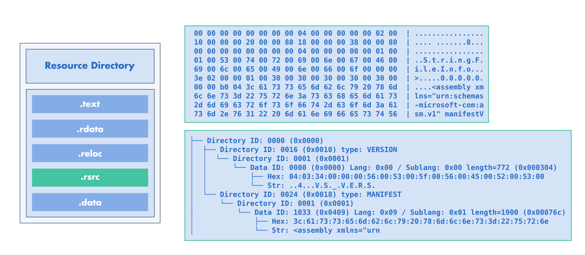

:fa:`solid fa-gears` Resources Modification
-------------------------------------------

LIEF allows to modify (or create) PE resources at different levels:

- Directly on the binary tree (|lief-pe-resource-node|)
- Using the |lief-pe-resource-manager|.

Binary Tree Modifications
*************************

The resource's root node can be accessed using the |lief-pe-binary-resources|
function:

.. tabs::

  .. tab:: :fa:`brands fa-python` Python

      .. code-block:: python

        import lief

        pe: lief.PE.Binary = ...

        rsrc: lief.PE.ResourceNode = pe.resources

        print(rsrc)

  .. tab:: :fa:`regular fa-file-code` C++

      .. code-block:: cpp

        #include <LIEF/PE.hpp>

        std::unique_ptr<LIEF::PE::Binary> pe;

        LIEF::PE::ResourceNode* rsrc = pe->resources();

        std::cout << *rsrc << '\n';

  .. tab:: :fa:`brands fa-rust` Rust

      .. code-block:: rust

        let mut pe: lief::pe::Binary;

        let mut rsrc = pe.resources().unwrap();

        println!("{}", &rsrc as &dyn NodeBase);

From this |lief-pe-resource-node| instance, one can use the
|lief-pe-resource-node-add-child| or |lief-pe-resource-node-remove-child|
functions to add or delete nodes:

.. tabs::

  .. tab:: :fa:`brands fa-python` Python

      .. code-block:: python

        rsrc: lief.PE.ResourceNode = pe.resources

        dir_node = lief.PE.ResourceDirectory(100)
        data_node = lief.PE.ResourceData([1, 2, 3])

        rsrc.add_child(dir_node).add_child(data_node)

  .. tab:: :fa:`regular fa-file-code` C++

      .. code-block:: cpp

        LIEF::PE::ResourceNode* root = pe->resources();

        LIEF::PE::ResourceDirectory dir_node(/*id=*/100);
        LIEF::PE::ResourceData data_node({1, 2, 3});

        (*root)
          .add_child(dir_node)
            .add_child(data_node);

        pe->write("new.exe");

  .. tab:: :fa:`brands fa-rust` Rust

      .. code-block:: rust

        let mut root = pe.resources();

        let mut dir_node = lief::pe::resources::Directory::with_id(100);
        let mut data_node = lief::pe::resources::Data::with_buffer(&vec![1, 2, 3]);

        dir_node.add_child(&Node::Data(data_node));
        root.add_child(&Node::Directory(dir_node));

        pe.write("new.exe");

This low-level API can be used to modify the tree or changing the data of a
specific node.

.. admonition:: Pretty Printing
  :class: tip

  One can also *print* a node to get a pretty representation of the resources
  tree:

  .. code-block:: python

    pe: lief.PE.Binary = ...
    tree = pe.resources
    print(tree)

  .. code-block:: text

    ├── Directory ID: 0000 (0x0000)
    │  ├── Directory ID: 0016 (0x0010) type: VERSION
    │  │  └── Directory ID: 0001 (0x0001)
    │  │      └── Data ID: 0000 (0x0000) Lang: 0x00 / Sublang: 0x00 length=772 (0x000304), offset: 0x1ca0
    │  │          ├── Hex: 04:03:34:00:00:00:56:00:53:00:5f:00:56:00:45:00:52:00:53:00
    │  │          └── Str: ..4...V.S._.V.E.R.S.
    │  └── Directory ID: 0024 (0x0018) type: MANIFEST
    │      └── Directory ID: 0001 (0x0001)
    │          └── Data ID: 1033 (0x0409) Lang: 0x09 / Sublang: 0x01 length=1900 (0x00076c), offset: 0x1fa4
    │              ├── Hex: 3c:61:73:73:65:6d:62:6c:79:20:78:6d:6c:6e:73:3d:22:75:72:6e
    │              └── Str: <assembly xmlns="urn

Resources Manager
*****************

The |lief-pe-resource-manager| is used to expose a higher-level API on
the resource tree. It can also be used to set or change resource elements such
as the manifest:

.. tabs::

  .. tab:: :fa:`brands fa-python` Python

      .. code-block:: python

        import lief

        pe: lief.PE.Binary = ...

        manager: lief.PE.ResourcesManager = pe.resources_manager

        manager.manifest = """
        <?xml version="1.0" standalone="yes"?>
        <assembly xmlns="urn:schemas-microsoft-com:asm.v1"
                  manifestVersion="1.0">
          <trustInfo>
            <security>
              <requestedPrivileges>
                 <requestedExecutionLevel level='asInvoker' uiAccess='false'/>
              </requestedPrivileges>
            </security>
          </trustInfo>
        </assembly>
        """

        pe.write("new.exe")

  .. tab:: :fa:`regular fa-file-code` C++

      .. code-block:: cpp

        #include <LIEF/PE.hpp>

        std::unique_ptr<LIEF::PE::Binary> pe;

        result<ResourcesManager> manager = pe->resources_manager();
        manager->manifest(R"manifest(
        <?xml version="1.0" standalone="yes"?>
        <assembly xmlns="urn:schemas-microsoft-com:asm.v1"
                  manifestVersion="1.0">
          <trustInfo>
            <security>
              <requestedPrivileges>
                 <requestedExecutionLevel level='asInvoker' uiAccess='false'/>
              </requestedPrivileges>
            </security>
          </trustInfo>
        </assembly>
        )manifest");

        pe->write("new.exe");

  .. tab:: :fa:`brands fa-rust` Rust

      .. code-block:: rust

        let mut pe: lief::pe::Binary;

        let mut manager = pe.resources_manager().unwrap();

        manager.set_manifest(r#"
        <?xml version="1.0" standalone="yes"?>
        <assembly xmlns="urn:schemas-microsoft-com:asm.v1"
                  manifestVersion="1.0">
          <trustInfo>
            <security>
              <requestedPrivileges>
                 <requestedExecutionLevel level='asInvoker' uiAccess='false'/>
              </requestedPrivileges>
            </security>
          </trustInfo>
        </assembly>
        "#);

        pe.write("new.exe");

Resource Tree Transfer between Binaries
***************************************

LIEF can transfer the resource tree from one binary to another.
This operation can be achieved by using the |lief-pe-binary-set_resources|
function:

.. tabs::

  .. tab:: :fa:`brands fa-python` Python

      .. code-block:: python

        import lief

        from_pe: lief.PE.Binary = ...
        to_pe: lief.PE.Binary = ...

        to_pe.set_resources(from_pe.resources)
        to_pe.write("new.exe")

  .. tab:: :fa:`regular fa-file-code` C++

      .. code-block:: cpp

        #include <LIEF/PE.hpp>

        std::unique_ptr<LIEF::PE::Binary> from;
        std::unique_ptr<LIEF::PE::Binary> to;

        to->set_resources(*from->resources());

        to->write("new.exe");

  .. tab:: :fa:`brands fa-rust` Rust

      .. code-block:: rust

        let from_pe: lief::pe::Binary;
        let to_pe: lief::pe::Binary;

        to_pe.set_resources(&from_pe.resources().unwrap());

.. include:: ../../../_cross_api.rst
