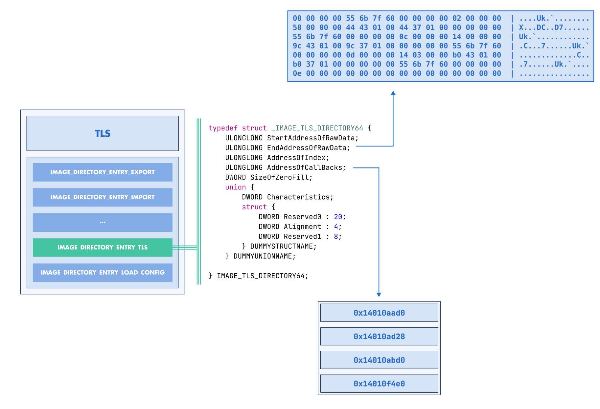

:fa:`solid fa-gears` TLS Modification
--------------------------------------

LIEF can be used to **modify**, **create**, or **remove** Thread Local Storage (TLS)
information.

TLS Modifications
~~~~~~~~~~~~~~~~~

All attributes of the |lief-pe-tls| interface can be modified as long as the
changes are consistent with the layout of the PE binary. For instance, you
can adjust the TLS callbacks by removing, reordering, or adding addresses:

.. tabs::

  .. tab:: :fa:`brands fa-python` Python

      .. code-block:: python

        import lief

        pe: lief.PE.Binary = ...

        callbacks: list[int] = pe.tls.callbacks

        # Remove the last entry
        callbacks.pop()

        # Add an address
        callbacks.append(0x140001010)

        tls.callbacks = callbacks

        pe.write("tls_modified.exe")

  .. tab:: :fa:`regular fa-file-code` C++

      .. code-block:: cpp

        #include <LIEF/PE.hpp>

        std::unique_ptr<LIEF::PE::Binary> pe;

        std::vector<uint64_t> callbacks = pe->callbacks();

        # Remove the last entry
        callbacks.pop_back();

        # Add an address
        callbacks.push_back(0x140001010);

        tls->callbacks(std::move(callbacks));

        pe->write("tls_modified.exe");

  .. tab:: :fa:`brands fa-rust` Rust

      .. code-block:: rust

        let mut pe: lief::pe::Binary;

        let mut tls = pe.tls().unwrap();

        let mut callbacks: Vec<u64> = tls.callbacks();

        # Remove the last entry
        callbacks.pop();

        # Add an address
        callbacks.push(0x140001010);

        tls.set_callbacks(callbacks);

        pe.write("tls_modified.exe");

.. admonition:: Relocations
  :class: tip

  Note that LIEF **automatically** manages the relocations that must be
  created or removed when modifying the TLS callbacks.

TLS Creation
~~~~~~~~~~~~

If a PE binary does not contain TLS metadata, LIEF can be used to create this
structure.

First, we can create and initiate a TLS instance:

.. tabs::

  .. tab:: :fa:`brands fa-python` Python

      .. code-block:: python

        import lief

        tls = lief.PE.TLS()

        tls.callbacks = [
            0x140001000,
            0x140001010,
        ]

  .. tab:: :fa:`regular fa-file-code` C++

      .. code-block:: cpp

        #include <LIEF/PE.hpp>

        LIEF::PE::TLS tls;

        tls.callbacks(std::vector<uint64_t> {
            0x140001000,
            0x140001010,
        });

  .. tab:: :fa:`brands fa-rust` Rust

      .. code-block:: rust

        use lief;

        let mut tls = lief::pe::TLS::new();

        tls.set_callbacks(vec![
          0x140001000,
          0x140001010,
        ]);

And then, we can add this instance to a |lief-pe-binary|:

.. tabs::

  .. tab:: :fa:`brands fa-python` Python

      .. code-block:: python

        pe: lief.PE.Binary = ...

        pe.tls = tls # `tls` defined previously

        pe.write("tls_demo.exe")

  .. tab:: :fa:`regular fa-file-code` C++

      .. code-block:: cpp

        std::unique_ptr<LIEF::PE::Binary> pe;

        pe->tls(tls); // `tls` defined previously

        pe->write("tls_demo.exe");

  .. tab:: :fa:`brands fa-rust` Rust

      .. code-block:: rust

        let mut pe: lief::pe::Binary;

        pe.set_tls(&tls); // `tls` defined previously

        pe.write("tls_demo.exe");

.. admonition:: Relocations
  :class: tip

  Similary to the TLS callbacks modifications, LIEF **automatically** manages the
  relocations. In addition, it automatically initialize (if not set by the user)
  ``AddressOfIndex`` which is mandatory when defining up TLS metadata.

.. include:: ../../../_cross_api.rst
