Installation and Integration
============================

SDK
---

For each platform supported by LIEF there is an SDK that contains:

* Static library
* Headers
* Examples

Nightly build can be downloaded on: https://lief-project.github.io/packages/sdk while releases are available
on Github release page: https://github.com/lief-project/LIEF/releases.

Python
------

.. _v10-label:

Since 0.10.0
************

To install nightly build (master):

.. code-block:: console

  $ pip install [--user] --index-url  https://lief-project.github.io/packages lief

You can also directly download the Python wheel package on: https://lief-project.github.io/packages/lief

.. note::

  If you already installed a nightly version of LIEF you may need the flag: ``--no-cache-dir``

To install **release** package

.. code-block:: console

  $ pip install lief

Release packages can be found on `PyPI <https://pypi.org/project/lief/>`_ and the Github release page: https://github.com/lief-project/LIEF/releases

Using ``setup.py``, one can build and install lief as follows:

.. code-block:: console

   $ python ./setup.py [--user] install

LIEF modules can also be parameterized using the following options:

.. code-block:: console

   $ python ./setup.py --help
   ...

   --lief-test         Build and make tests
   --ninja             Use Ninja as build system
   --sdk               Build SDK package
   --lief-no-json      Disable JSON module
   --lief-no-logging   Disable logging module
   --lief-no-elf       Disable ELF module
   --lief-no-pe        Disable PE module
   --lief-no-macho     Disable Mach-O module
   --lief-no-android   Disable Android formats
   --lief-no-art       Disable ART module
   --lief-no-vdex      Disable VDEX module
   --lief-no-oat       Disable OAT module
   --lief-no-dex       Disable DEX module

From 0.8.0 to 0.9.0
*******************

To install **release** package

.. code-block:: console

  $ pip install pylief-VERSION.zip

Release packages can be found here: `Releases <https://github.com/lief-project/LIEF/releases>`_

Before 0.8.0
************

To install the Python API (example with ``Python 3.5``):

.. code-block:: console

  $ pip install lief-XX.YY.ZZ_py35.tar.gz

Visual Studio Integration
-------------------------

The pre-built SDK is compiled in release configuration with the *Multi-threaded* runtime library.

As example we compile the following snippet with Visual Studio 2015

.. code-block:: cpp

  #include "stdafx.h"

  #include <LIEF/LIEF.hpp>

  int main()
  {
    std::unique_ptr<LIEF::PE::Binary> pe_binary = LIEF::PE::Parser::parse("C:\\Windows\\explorer.exe");
    std::cout << *pe_binary << std::endl;
    return 0;
  }

First the build type must be set to ``Release``:

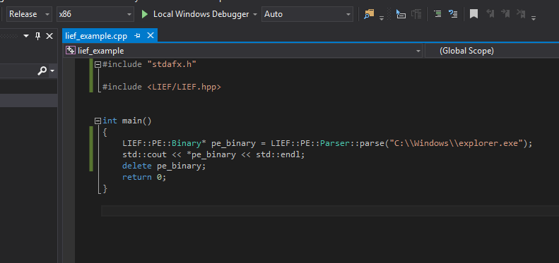

  Build type set to ``Release``

Then we need to specify the location of the LIEF include directory:

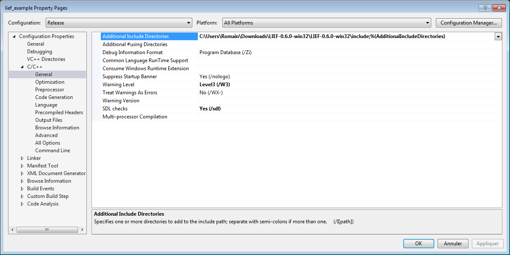

  LIEF include directory

and the location of the ``LIEF.lib`` library:

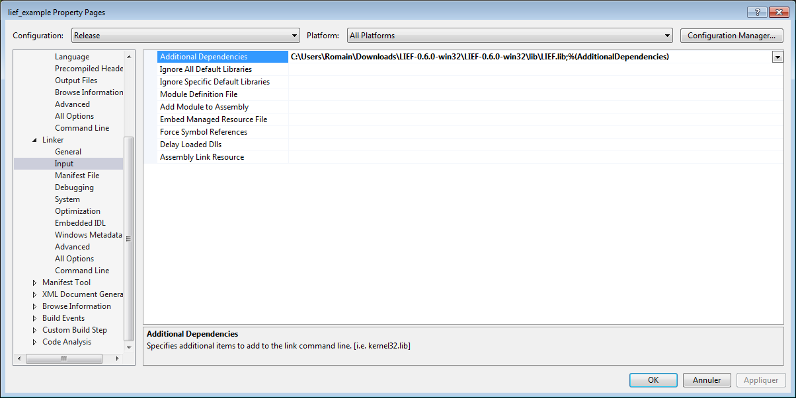

  LIEF library

As ``LIEF.lib`` was compiled with the ``\MT`` flag we have to set it:

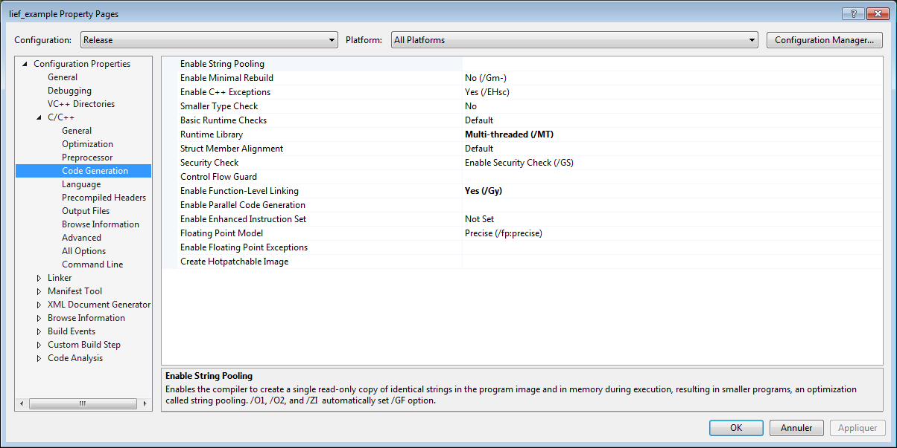

  *Multi-threaded* as runtime library

LIEF makes use of ``and, or, not`` C++ keywords. As **MSVC** doesn't support these keywords by default, we need to add the special file ``iso646.h``:

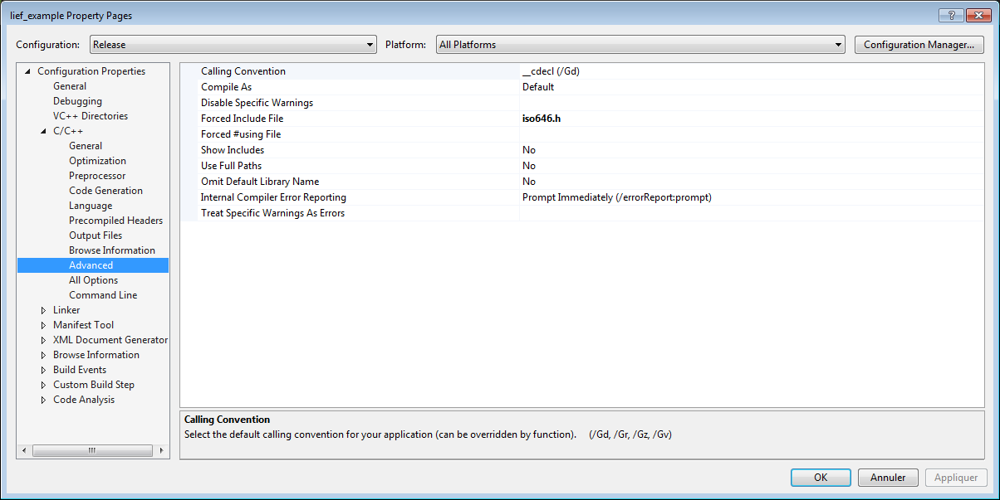

  Add ``iso646.h`` file

XCode Integration
-----------------

To integrate LIEF within a XCode project, one needs to follow these steps:

First we create a new project:

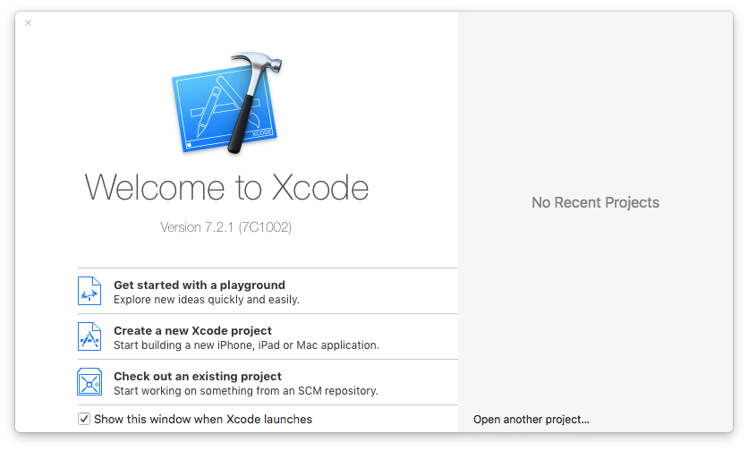

  New Project

For this example we select a *Command Line Tool*:

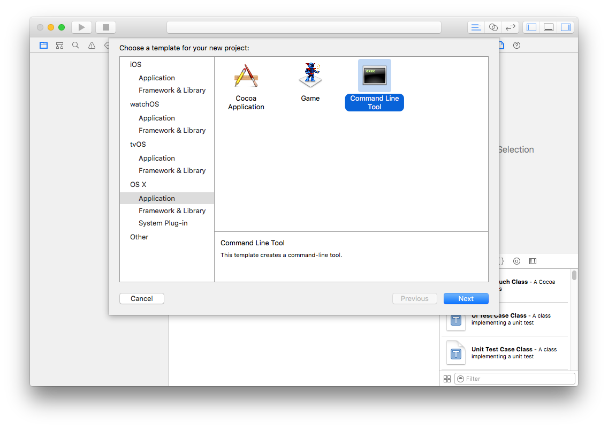

  Command Line Tool

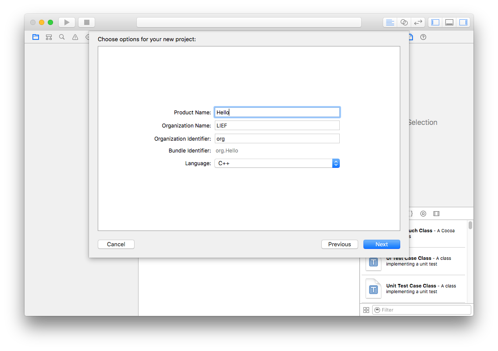

  Project options

Then we need to add the static library ``libLIEF.a`` or the shared one (``libLIEF.dylib``)

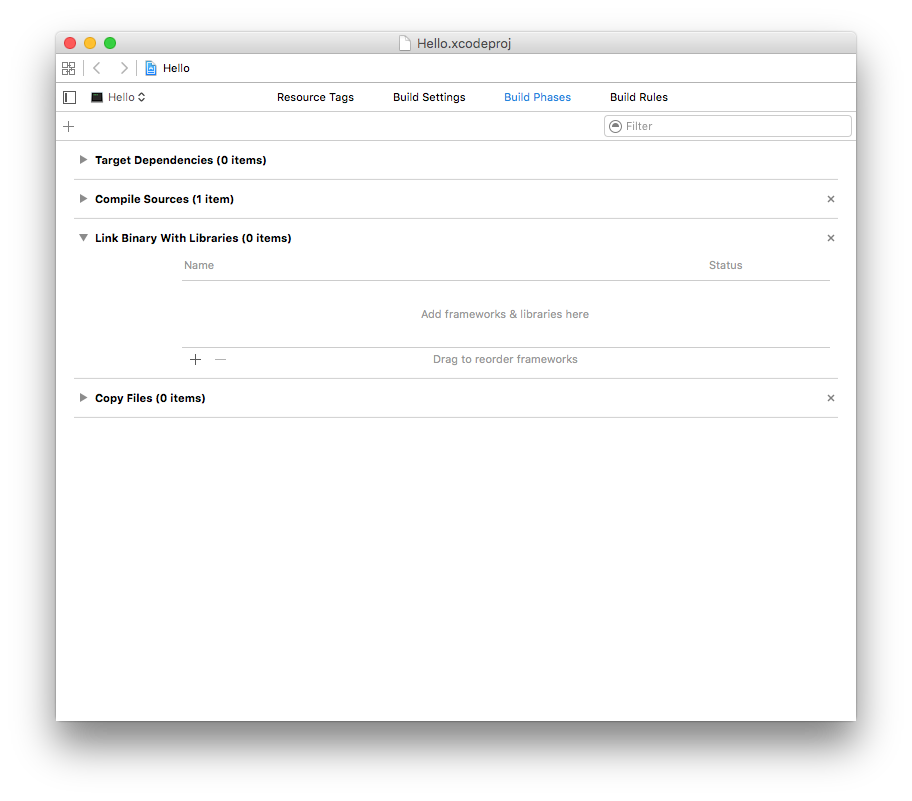

  Project configuration - Build Phases

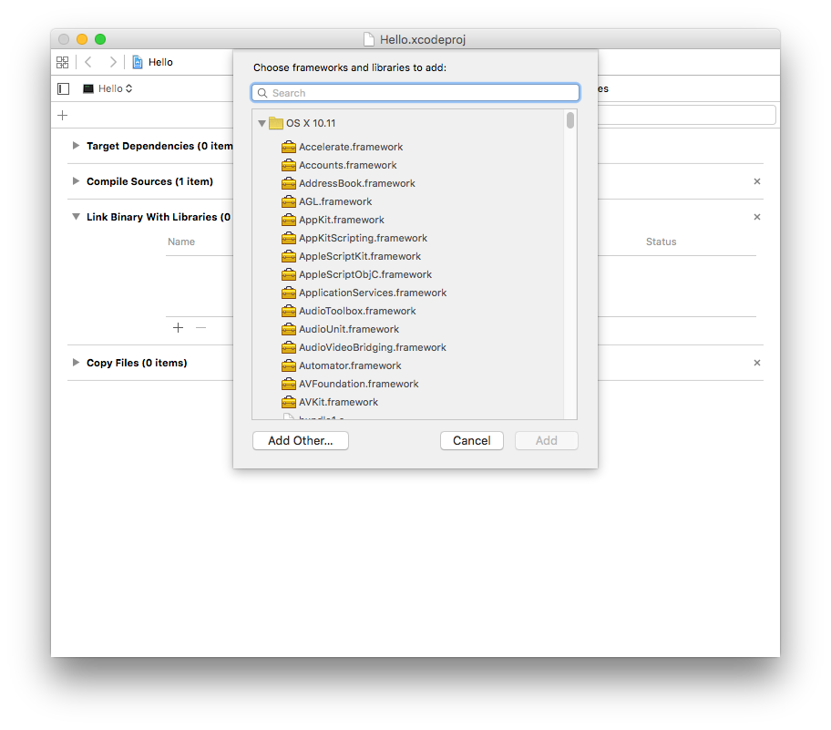

  Project configuration - Build Phases

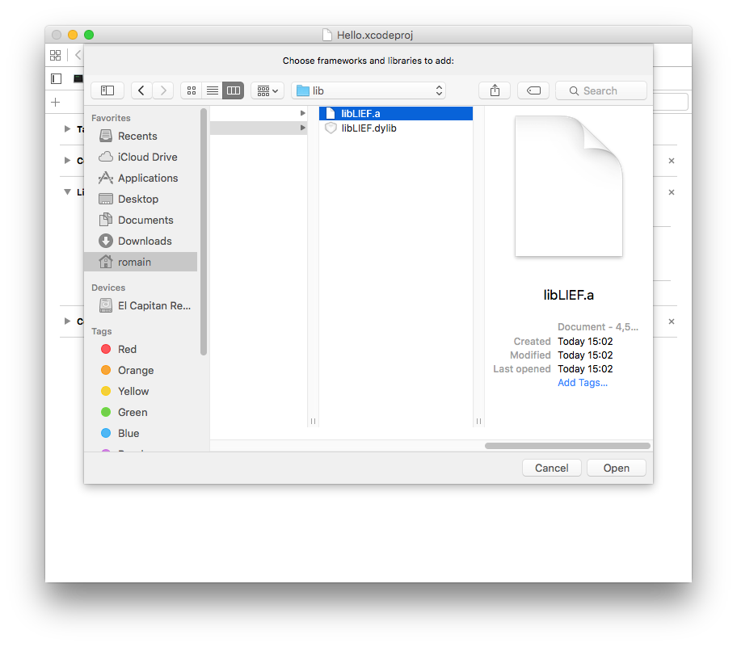

  Project configuration - Build Phases

In the `Build Settings - Search Paths` one needs to specify the paths to the **include directory** and to location of the LIEF libraries (``libLIEF.a`` and/or ``libLIEF.dylib``)

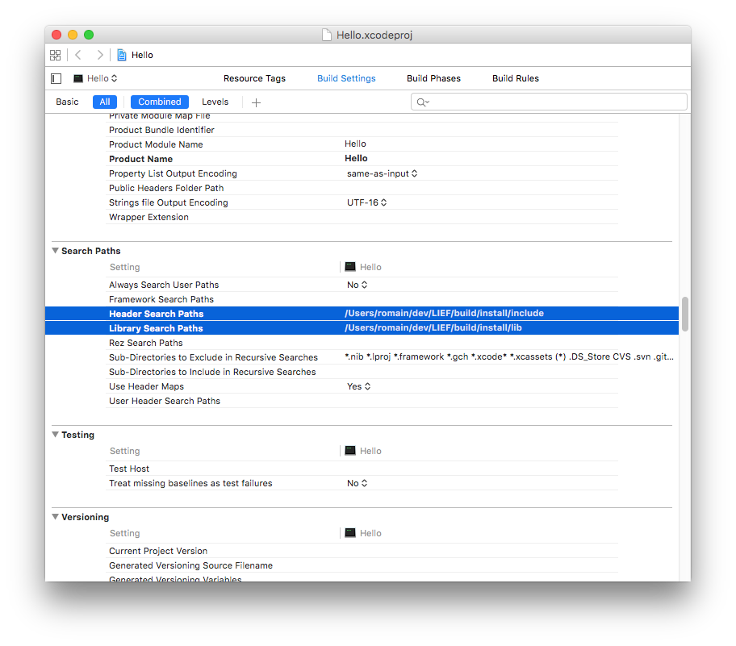

  Libraries and Include search paths

Once the new project configured we can use LIEF:

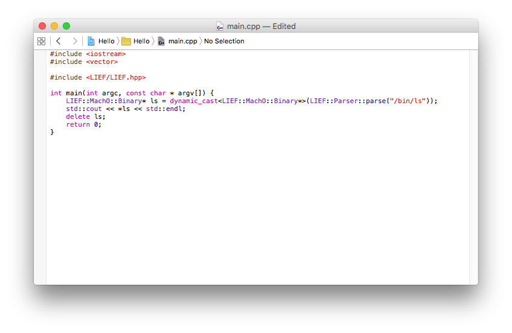

  Source code

and run it:

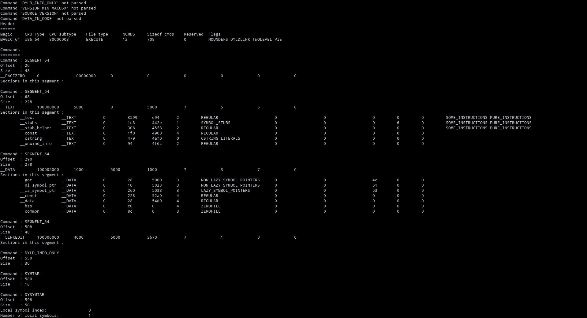

  Output

CMake Integration
-----------------

There are a few ways to integrate LIEF as a dependency in another project. The different methods are listed in order of preference and CMake best practice. These listings are only to show basic examples. Please refer to the CMake documentation for questions related to more complex project setup.

find_package()
**************

Using `CMake find_package() <https://cmake.org/cmake/help/v3.0/command/find_package.html>`_:

.. literalinclude:: ../../examples/cmake/find_package/CMakeLists.txt
   :language: cmake
   :lines: 5-12

And now, to be integrated within a project:

.. literalinclude:: ../../examples/cmake/find_package/CMakeLists.txt
   :language: cmake
   :lines: 13-

For the compilation:

.. include:: ../../examples/cmake/find_package/README.rst
   :start-line: 3

A *full* example is available in the ``examples/cmake/find_package`` directory.

add_subdirectory() or FetchContent
**********************************

First, set up the options you want to set as default for the LIEF project:

.. literalinclude:: ../../examples/cmake/add_subdirectory/CMakeLists.txt
   :language: cmake
   :lines: 7-19

Using `CMake add_subdirectory() <https://cmake.org/cmake/help/v3.0/command/add_subdirectory.html>`_ to add a submodule LIEF source directory:

.. literalinclude:: ../../examples/cmake/add_subdirectory/CMakeLists.txt
   :language: cmake
   :lines: 21-28

If we are using a CMake version greater than or equal to 3.11, we can use `CMake FetchContent module <https://cmake.org/cmake/help/v3.11/module/FetchContent.html>`_ to download or specify a LIEF source directory outside of the current directory:

.. literalinclude:: ../../examples/cmake/add_subdirectory/CMakeLists.txt
   :language: cmake
   :lines: 33-61

And now, to be integrated within a project:

.. literalinclude:: ../../examples/cmake/add_subdirectory/CMakeLists.txt
   :language: cmake
   :lines: 65-

For the compilation:

.. include:: ../../examples/cmake/add_subdirectory/README.rst
   :start-line: 3

A *full* example is available in the ``examples/cmake/add_subdirectory`` directory.

External Project
****************

If you don't want to use LIEF as a submodule or upgrade to CMake 3.11, we can use `CMake External Project <https://cmake.org/cmake/help/v3.0/module/ExternalProject.html>`_ to set up a project as a `*superbuild* <https://www.kitware.com/cmake-superbuilds-git-submodules>`_:

.. literalinclude:: ../../examples/cmake/external_project/CMakeLists.txt
   :language: cmake
   :lines: 1-41

And now, to be integrated with our main ``HelloLIEF`` project that is located in a subdirectory and looks exactly like the ``find_package()`` example shown earlier:

.. literalinclude:: ../../examples/cmake/external_project/CMakeLists.txt
   :language: cmake
   :lines: 44-

For the compilation:

.. include:: ../../examples/cmake/external_project/README.rst
   :start-line: 3

A *full* example is available in the ``examples/cmake/external_project`` directory.
