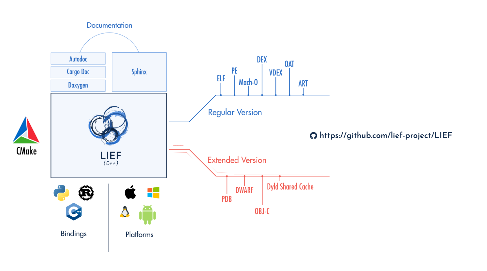

:fa:`solid fa-door-open` Introduction
=====================================

The purpose of this project is to provide a cross-platform library to parse,
modify, and abstract :ref:`ELF <format-elf>`, :ref:`PE <format-pe>`, and
:ref:`Mach-O <format-macho>` formats.

From a technical standpoint, the library is written in C++ with a C++11 public
interface and exposes bindings for Python and Rust.

Hence, you can use LIEF with an idiomatic API in these languages:

.. tabs::

  .. tab:: :fa:`brands fa-python` Python

    .. code-block:: python

      import lief

      elf: lief.ELF.Binary = lief.ELF.parse("libc.so")

      for symbol in elf.symbols:
          print(symbol.address, symbol.name)

      print(elf.header)

      for entry in elf.dynamic_entries:

        if isinstance(entry, lief.ELF.DynamicEntryLibrary):
            entry.name = "libhello.so"

      elf.write("modified.elf")

  .. tab:: :fa:`regular fa-file-code` C++

    .. code-block:: cpp

      #include <LIEF/LIEF.hpp>

      std::unique_ptr<LIEF::MachO::FatBinary> fat =
        LIEF::MachO::Parser::parse("libobjc.dylib");

      for (const LIEF::MachO::Binary& macho : fat) {
        for (const LIEF::MachO::BindingInfo& binding : macho.bindings()) {
          std::cout << binding.address() << ' ' << bindings.symbol()->name() << '\n';
        }

        if (macho.is_ios()) {
          if (const LIEF::MachO::EncryptionInfo* info = macho.encryption_info())
          {
            std::cout << info->crypt_id() << '\n';
          }
        }
      }

  .. tab:: :fa:`brands fa-rust` Rust

    .. code-block:: rust

      let mut file = std::fs::File::open(path).expect("Can't open the file");

      if let Some(lief::Binary::PE(pe)) = lief::Binary::from(&mut file) {
          let rich_header = pe.rich_header().unwrap_or_else(|| {
              println!("Rich header not found!");
              process::exit(0);
          });

          println!("Rich header key: 0x{:x}", rich_header.key());
          for entry in rich_header.entries() {
              println!("id: 0x{:04x} build_id: 0x{:04x} count: #{}",
                       entry.id(), entry.build_id(), entry.count());
          }

          let result = pe.verify_signature(pe::signature::VerificationChecks::DEFAULT);
          if result.is_ok() {
              println!("Valid signature!");
          } else {
              println!("Signature not valid: {}", result);
          }
      }

This project is also attached to provide comprehensive documentation as well
as development best practices:

- A regular test suite associated with test coverage and non-regression testing
- Address sanitizer checks (`ASAN <https://clang.llvm.org/docs/AddressSanitizer.html>`_)
- CI for testing and releasing packages
- Dockerization of the different CI steps
- A comprehensive :ref:`changelog <changelog-ref>`
- Nightly builds

|

To get started with LIEF functionalities, you can check the documentation of one of these
formats: :ref:`ELF <format-elf>`, :ref:`PE <format-pe>`, or :ref:`Mach-O <format-macho>`
and to start integrating LIEF in your project it should be pretty
straightforward:

.. tabs::

  .. tab:: :fa:`brands fa-python` Python

      **With pip**

      .. code-block:: console

        $ pip install lief

      **Using a requirement.txt file**

      .. code-block:: text

        lief==0.16.0

  .. tab:: :fa:`regular fa-file-code` C++

      **Compiler command line**

      .. code-block:: console

        $ clang++ -lLIEF -I<LIEF_INSTALL>/include/ ...

      **CMake**

      .. code-block:: cmake

        find_package(LIEF)

        target_link_libraries(my-project LIEF::LIEF)

  .. tab:: :fa:`brands fa-rust` Rust

      **Nightly version**

      .. code-block:: toml

        # For nightly build
        [dependencies]
        lief = { git = "https://github.com/lief-project/LIEF", branch = "main" }

      **Released version**

      .. code-block:: toml

        # For a tagged release
        [dependencies]
        lief = "0.16.0"

You can also find additional content in the `LIEF's blog </blog/>`_ post among those:

- `LIEF 0.16.0 release info </blog/2024-12-10-lief-0-16-0/>`_
- `LIEF 0.15.0 release info </blog/2024-07-21-lief-0.15-0/>`_
- `LIEF 0.14.0 release info </blog/2024-01-20-lief-0-14-0/>`_
- `LIEF 0.13.0 release info </blog/2023-04-09-lief-0-13-0/>`_
- `LIEF 0.12.0 release info </blog/2022-03-27-lief-v0-12-0/>`_
- `LIEF 0.11.1 release info </blog/2021-02-22-lief-0-11-1/>`_
- `LIEF 0.11.0 release info </blog/2021-01-19-lief-0-11-0/>`_
- `LIEF 0.9.0 release info </blog/2018-06-11-lief-0-9-0/>`_

As well as in the `examples/ <https://github.com/lief-project/LIEF/tree/main/examples>`_
directory

:fa:`cubes` Extended Version
~~~~~~~~~~~~~~~~~~~~~~~~~~~~

For those who seek for enhanced support for :ref:`PDB <extended-pdb>`,
:ref:`DWARF <extended-dwarf>` or :ref:`Objective-C <extended-objc>` (and more),
you can check the :ref:`extended section <extended-intro>`.

:fa:`solid fa-book` Additional Documentation
~~~~~~~~~~~~~~~~~~~~~~~~~~~~~~~~~~~~~~~~~~~~

* :fa:`solid fa-book` `Doxygen <../../doxygen/>`_
* :fa:`brands fa-rust` Rust documentation:

  - Stable: |lief-rust-doc|
  - Nightly: |lief-rust-doc-nightly|

