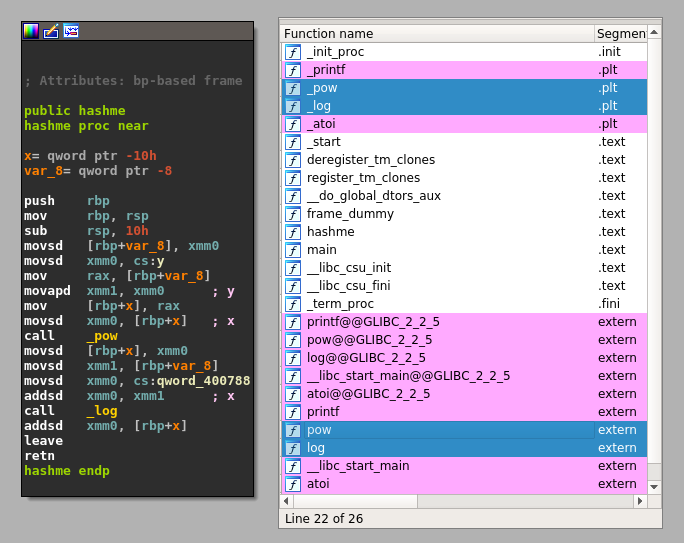
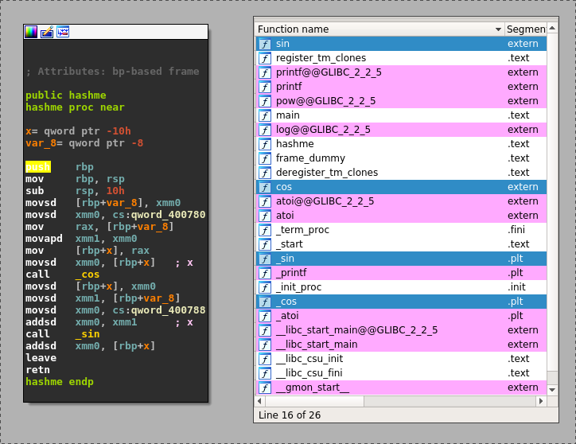

03 - Play with ELF symbols
--------------------------

In this tutorial, we will see how to modify dynamic symbols in both an executable and a library.

Scripts and materials are available here: `materials <https://github.com/lief-project/tutorials/tree/master/03_ELF_change_symbols>`_

By Romain Thomas - `@rh0main <https://twitter.com/rh0main>`_

-----

When a library is dynamically linked to an executable, the required libraries are referenced in the ``DT_NEEDED`` entries within the
dynamic table (``PT_DYNAMIC``).

In addition, the functions imported from this library are referenced in the dynamic symbols table with the following attributes:

* :attr:`~lief.ELF.Symbol.value` set to ``0``
* :attr:`~lief.ELF.Symbol.type` set to :attr:`~lief.ELF.Symbol.TYPE.FUNC`

Similarly, when a library exports functions the exported functions
are registered in the dynamic symbols table with the following attributes:

* :attr:`~lief.ELF.Symbol.value` set to the address of the function in the library
* :attr:`~lief.ELF.Symbol.type` set to :attr:`~lief.ELF.Symbol.TYPE.FUNC`

Imported and exported functions are abstracted in LIEF and one can iterate over these elements through
the properties: :attr:`~lief.Binary.exported_functions` and :attr:`~lief.Binary.imported_functions`

.. code-block:: python

  import lief
  binary  = lief.parse("/usr/bin/ls")
  library = lief.parse("/usr/lib/libc.so.6")

  print(binary.imported_functions)
  print(library.exported_functions)

When analyzing a binary, the imported functions can reveal information about the underlying functionalities of the binary.
To avoid revealing the imported symbols, one solution could consist in statically linking the library with the executable.
Another solution is to blow the reverser's mind by swapping these symbols which is the purpose of this tutorial.

Let's consider the following code:

.. code-block:: C

  #include <stdio.h>
  #include <stdlib.h>
  #include <math.h>

  double hashme(double input) {
    return pow(input, 4) + log(input + 3);
  }

  int main(int argc, char** argv) {
    if (argc != 2) {
      printf("Usage: %s N\n", argv[0]);
      return EXIT_FAILURE;
    }

    double N = (double)atoi(argv[1]);
    double hash = hashme(N);
    printf("%f\n", hash);

    return EXIT_SUCCESS;
  }

Basically, this program takes an integer as a parameter and performs some computation on this value.

.. code-block:: console

  $ hashme 123
  228886645.836282

The ``pow`` and ``log`` functions are located in the ``libm.so.6`` library.
Using LIEF, we can swap this function **name** with other functions **name**.
For instance, let's swap ``pow`` and ``log`` with ``cos`` and ``sin``:

First, we have to load both the library and the executable:

.. code-block:: python

  #!/usr/bin/env python3
  import lief

  hashme = lief.parse("hashme")
  libm  = lief.parse("/usr/lib/libm.so.6")
  # Note: the path to libm.so.6 might be different on your system.

Then, we can change the name of the two imported functions in the **executable**:

.. code-block:: python

  hashme_pow_sym = next(i for i in hashme.imported_symbols if i.name == "pow")
  hashme_log_sym = next(i for i in hashme.imported_symbols if i.name == "log")

  hashme_pow_sym.name = "cos"
  hashme_log_sym.name = "sin"

And we need to do the same in the library: the ``log`` symbol's name is swapped with ``sin`` and ``pow`` with ``cos``:

.. code-block:: python

  #!/usr/bin/env python3
  import lief

  hashme = lief.parse("hashme")
  libm  = lief.parse("/usr/lib/libm.so.6")

  def swap(obj, a, b):
      symbol_a = next(i for i in obj.dynamic_symbols if i.name == a)
      symbol_b = next(i for i in obj.dynamic_symbols if i.name == b)
      b_name = symbol_b.name
      symbol_b.name = symbol_a.name
      symbol_a.name = b_name

  hashme_pow_sym = next(i for i in hashme.imported_symbols if i.name == "pow")
  hashme_log_sym = next(i for i in hashme.imported_symbols if i.name == "log")

  hashme_pow_sym.name = "cos"
  hashme_log_sym.name = "sin"

  swap(libm, "log", "sin")
  swap(libm, "pow", "cos")

  hashme.write("hashme.obf")
  libm.write("libm.so.6")

At this point, we have a modified version of ``libm.so`` in the same directory as ``hashme.obf``.
To force loading this modified version of ``libm.so``, we can set the environment variable ``LD_LIBRARY_PATH``:

.. code-block:: console

  $ LD_LIBRARY_PATH=. hashme.obf 123
  228886645.836282

Without this environment variable, the Linux loader would resolve ``libm.so`` with the original path and the
computation would be done with ``sin`` and ``cos``:

.. code-block:: console

  $ hashme.obf 123
  -0.557978

One other more realistic use case could consist in swapping symbols in cryptographic libraries like OpenSSL.
For instance, ``EVP_DecryptInit`` and ``EVP_EncryptInit`` have the same prototype and could be swapped.

