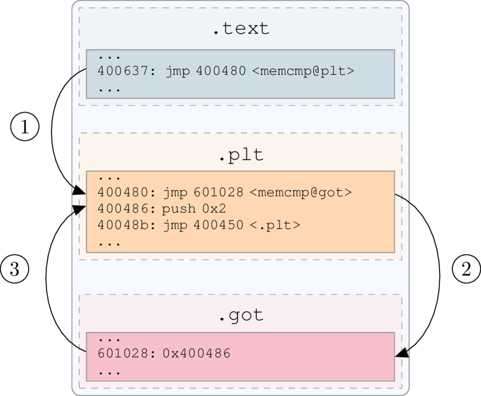
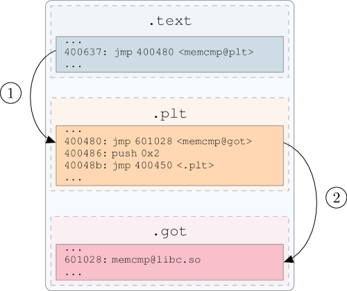
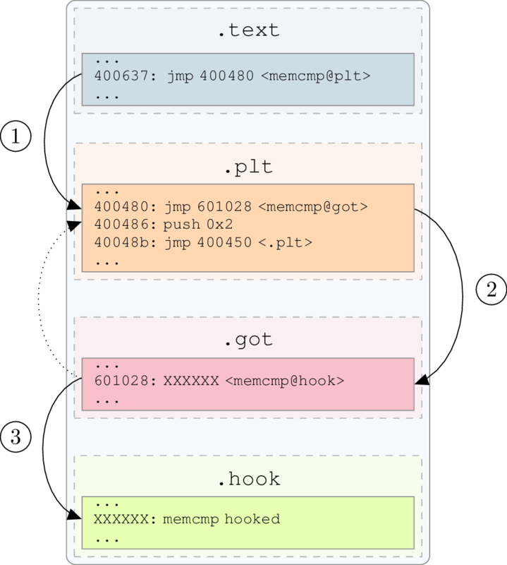

05 - Infecting the plt/got
--------------------------

The objective of this tutorial is to hook an imported function in an ELF binary.

Scripts and materials are available here: `materials <https://github.com/lief-project/tutorials/tree/master/05_ELF_infect_plt-got>`_

By Romain Thomas - `@rh0main <https://twitter.com/rh0main>`_

-----

Hooking imported functions by infecting the ``.got`` section is a well-known technique [#f1]_ [#f2]_ and this tutorial will be focused
on its implementation using LIEF.

These figures illustrate the ``plt/got`` mechanism:

  With lazy binding, the first time that the function is called the ``got`` entry redirects to the plt instruction.

  The Second time, ``got`` entry holds the address in the shared library.

Basically the infection is done in two steps:

  * Firstly, we inject our hook
  * Secondly, we redirect the targeted function to our hook by patching the ``got``

It can be summed up by the following figure:

As example, we will use a basic *crackme* which performs a :manpage:`memcmp(3)` on the flag and user's input.

.. code-block:: cpp

  #include <stdio.h>
  #include <stdlib.h>
  #include <string.h>

  // Damn_YoU_Got_The_Flag
  char password[] = "\x18\x3d\x31\x32\x03\x05\x33\x09\x03\x1b\x33\x28\x03\x08\x34\x39\x03\x1a\x30\x3d\x3b";

  inline int check(char* input);

  int check(char* input) {
    for (int i = 0; i < sizeof(password) - 1; ++i) {
      password[i] ^= 0x5c;
    }
    return memcmp(password, input, sizeof(password) - 1);
  }

  int main(int argc, char **argv) {
    if (argc != 2) {
      printf("Usage: %s <password>\n", argv[0]);
      return EXIT_FAILURE;
    }

    if (strlen(argv[1]) == (sizeof(password) - 1) && check(argv[1]) == 0) {
      puts("You got it !!");
      return EXIT_SUCCESS;
    }

    puts("Wrong");
    return EXIT_FAILURE;

  }

The flag is *xored* with ``0x5C``. To validate the *crackme*, the user has to enter ``Damn_YoU_Got_The_Flag``:

.. code-block:: console

  $ crackme.bin foo
  Wrong
  $ crackme.bin Damn_YoU_Got_The_Flag
  You got it !!

The hook will consist in printing arguments of ``memcmp`` and returning ``0``:

.. code-block:: cpp

  #include "arch/x86_64/syscall.c"
  #define stdout 1

  int my_memcmp(const void* lhs, const void* rhs, int n) {
    const char msg[] = "Hook memcmp\n";
    _write(stdout, msg, sizeof(msg));
    _write(stdout, (const char*)lhs, n);
    _write(stdout, "\n", 2);
    _write(stdout, (const char*)rhs, n);
    _write(stdout, "\n", 2);
    return 0;
  }

As the hook is going to be injected into the crackme, it must have the following requirements:

* Assembly code must be *position independant* (compiled with ``-fPIC`` or ``-pie/-fPIE`` flags)
* Don't use external libraries such as ``libc.so`` (``-nostdlib -nodefaultlibs`` flags)

Due to the requirements, the hook is compiled with: :code:`gcc -nostdlib -nodefaultlibs -fPIC -Wl,-shared hook.c -o hook`.

Injecting the hook
~~~~~~~~~~~~~~~~~~

The first step is to inject the hook into the binary. To do so we will add a :class:`~lief.ELF.Segment`:

.. code-block:: python

  import lief

  crackme = lief.parse("crackme.bin")
  hook    = lief.parse("hook")

  segment_added  = crackme.add(hook.segments[0])

All assembly code of the hook stands in the first :attr:`~lief.ELF.Segment.TYPE.LOAD` segment of ``hook``.

Once the hook added, its virtual address is :attr:`~lief.ELF.Segment.virtual_address` of ``segment_added``  and we can processed to the ``got`` patching.

Patching the ``got``
~~~~~~~~~~~~~~~~~~~~

LIEF provides a function to easily patch the ``got`` entry associated with a :class:`~lief.ELF.Symbol`:

.. automethod:: lief.ELF.Binary.patch_pltgot
  :noindex:

The offset of the ``memcmp`` function is stored in the :attr:`~lief.ELF.Symbol.value` attribute of the associated dynamic symbol. Thus its virtual address will be:

* ``my_memcpy``: :attr:`~lief.ELF.Symbol.value` + ``segment_added.virtual_address``

.. code-block:: python

  my_memcmp      = hook.get_symbol("my_memcmp")
  my_memcmp_addr = segment_added.virtual_address + my_memcmp.value

Finally we can patch the ``memcmp`` from the crakme with this value:

.. code-block:: python

  crackme.patch_pltgot('memcmp', my_memcmp_addr)

And rebuild it:

.. code-block:: python

  crackme.write("crackme.hooked")

Run
~~~

As a check on the input size is performed before checking the flag value, we have to provide an input with the correct length (no matter its content):

.. code-block:: console

  $ crackme.hooked XXXXXXXXXXXXXXXXXXXXX
  Hook add
  Damn_YoU_Got_The_Flag
  XXXXXXXXXXXXXXXXXXXXX
  You got it !!

.. rubric:: References

.. role:: strike
   :class: strike

.. [#f1] :strike:`hxxp://vxheaven.org/lib/vrn00.html`
.. [#f2] http://phrack.org/issues/56/7.html

