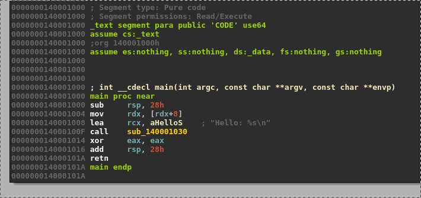
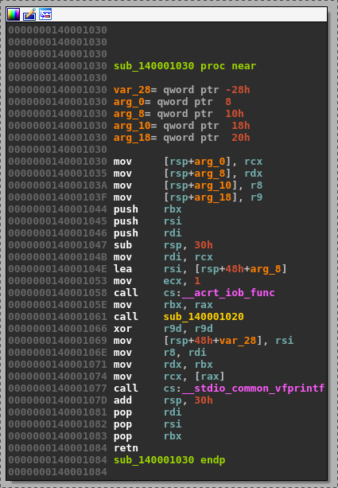
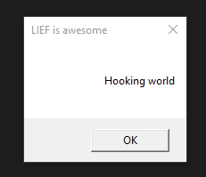

06 - PE Hooking (Deprecated)
----------------------------

.. warning::

  This tutorial is no longer working as the PE hooking functions has been removed from LIEF.

The objective of this tutorial is show how we can hook imported functions

Scripts and materials are available here: `materials <https://github.com/lief-project/tutorials/tree/master/06_PE_hooking>`_

By Romain Thomas - `@rh0main <https://twitter.com/rh0main>`_

------

The targeted binary is a simple ``PE64`` *HelloWorld* which prints the first argument in the console:

.. code-block:: cpp

  #include "stdafx.h"
  #include <stdio.h>

  int main(int argc, char** argv) {
    printf("Hello: %s\n", argv[1]);
    return 0;
  }

.. code-block:: console

  $ PE64_x86-64_binary_HelloWorld.exe World
  $ Hello: World

Using LIEF, we will replace the function that prints the message in the console with a ``MessageBox``

By disassembling the binary we can see that the *print* occurs in the function ``sub_140001030`` and it uses two
external functions: ``__acrt_iob_func`` and ``__stdio_common_vfprintf``.

Due to the Microsoft x64 calling convention, the format is located in the ``rcx`` and the input message in the ``rdx`` register.

Basically the :ref:`hooking-code` replaces the ``__acrt_iob_func`` function and shows a ``MessageBox`` with the ``rdx`` message.

.. code-block:: nasm
  :caption: hooking code
  :name: hooking-code

  add rsp, 0x48         ; Stack unwind
  xor rcx, rcx          ; hWnd
  mov rdx, rdx          ; Message
  mov r8,  0x0140009000 ; Title
  xor r9, r9            ; MB_OK
  mov rax, 0x014000A3E4 ; MessageBoxA address
  call [rax]            ; MessageBoxA(hWnd, Message, Title, MB_OK)
  xor rcx, rcx          ; exit value
  mov rax, 0x014000A3d4 ; ExitProcess address
  call [rax]            ; ExitProcess(0)
  ret                   ; Never reached

.. note::

  As for tutorial :ref:`02-pe-from-scratch`, the address of ``MessageBoxA`` and ``ExitProcess`` can be found
  with the function:

  .. automethod:: lief.PE.Binary.predict_function_rva
    :noindex:

First we create the ``.htext`` section which will hold the hooking code:

.. code-block:: python

  section_text                 = lief.PE.Section(".htext")
  section_text.content         = code
  section_text.virtual_address = 0x7000
  section_text.characteristics = lief.PE.SECTION_CHARACTERISTICS.CNT_CODE | lief.PE.SECTION_CHARACTERISTICS.MEM_READ | lief.PE.SECTION_CHARACTERISTICS.MEM_EXECUTE

  section_text = pe.add_section(section_text)

Then the ``.hdata`` section for the ``MessageBox`` title:

.. code-block:: python

  title   = "LIEF is awesome\0"
  data =  list(map(ord, title))

  section_data                 = lief.PE.Section(".hdata")
  section_data.content         = data
  section_data.virtual_address = 0x8000
  section_data.characteristics = lief.PE.SECTION_CHARACTERISTICS.CNT_INITIALIZED_DATA | lief.PE.SECTION_CHARACTERISTICS.MEM_READ

  section_data = pe.add_section(section_data)

As the ASLR is enabled we will disable it to avoid to deal with relocations:

.. code-block:: python

  binary.optional_header.dll_characteristics &= ~lief.PE.DLL_CHARACTERISTICS.DYNAMIC_BASE

We will also disable the ``NX`` protection:

.. code-block:: python

  binary.optional_header.dll_characteristics &= ~lief.PE.DLL_CHARACTERISTICS.NX_COMPAT

As ``ExitProcess`` is not imported in ``KERNEL32.dll`` we need to add it:

.. code-block:: python

  kernel32 = binary.get_import("KERNEL32.dll")
  kernel32.add_entry("ExitProcess")

The ``MessageBoxA`` function is located in the ``user32.dll`` thus we have to add it:

.. code-block:: python

  user32 = binary.add_library("user32.dll")
  user32.add_entry("MessageBoxA")

Then we proceed to the hook of the ``__acrt_iob_func`` function:

.. code-block:: python

  pe.hook_function("__acrt_iob_func", binary.optional_header.imagebase + section_text.virtual_address)

And finally we configure the :class:`~lief.PE.Builder` to create a new import table and to patch the original one with trampolines.

.. code-block:: python

  builder = lief.PE.Builder(binary)

  builder.build_imports(True).patch_imports(True)

  builder.build()

  builder.write("lief_pe_hooking.exe")

Now we can run the final executable:

.. code-block:: console

  $ lief_pe_hooking.exe "Hooking World"

