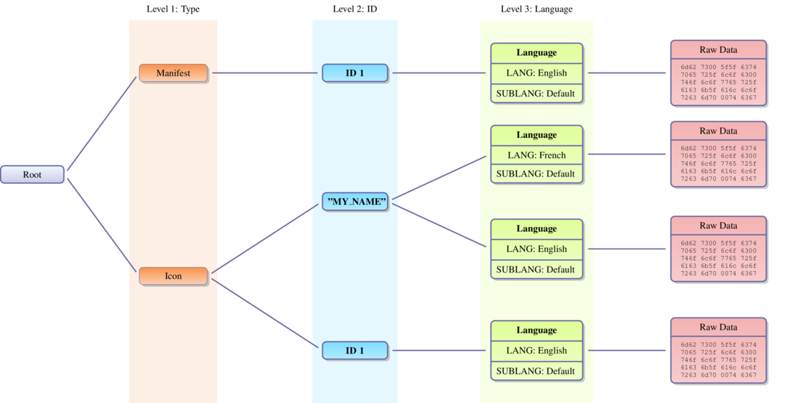
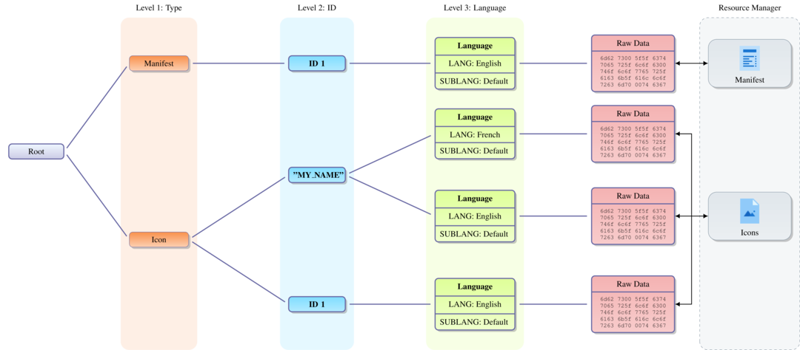
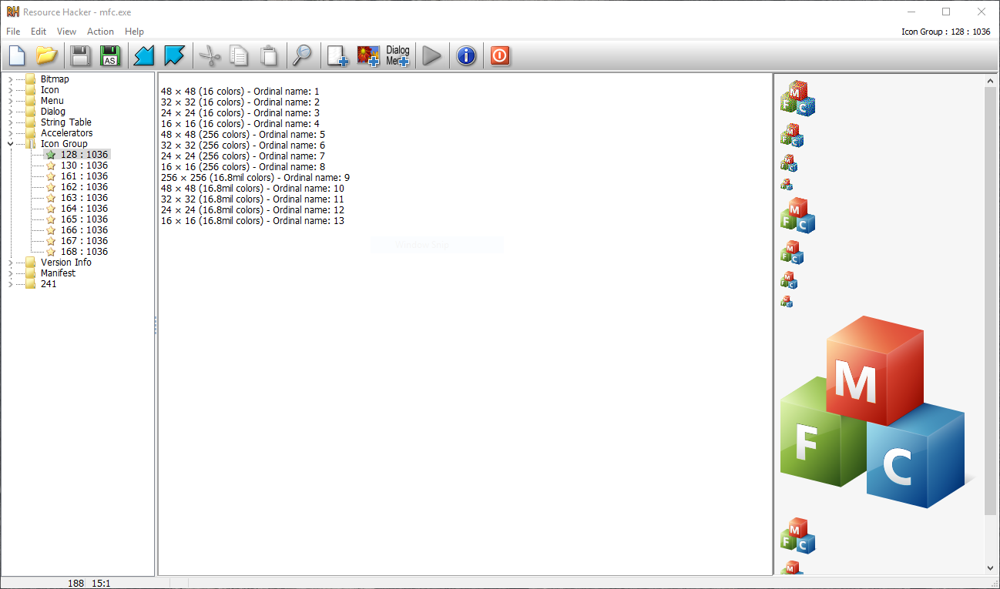
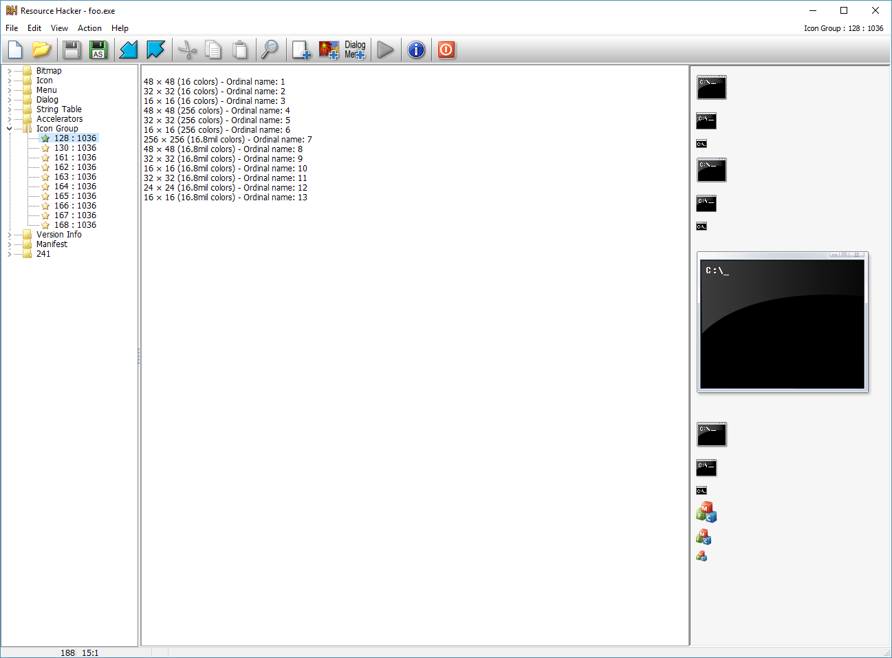

07 - PE Resources
-----------------

This tutorial gives an overview of the resource structure in a PE file and how they can be manipulated using LIEF

Scripts and materials are available here: `materials <https://github.com/lief-project/tutorials/tree/master/07_PE_resource>`_

By Romain Thomas - `@rh0main <https://twitter.com/rh0main>`_

------

Unlike **ELF** and **Mach-O** formats, **PE** enables to embed *resources* (icons, images, raw, dialog ...) within an
executable or a DLL.

These resources are usually located in the ``.rsrc`` section but this is not an absolute rule.

To retrieve the section in which resources are located, one can use the :attr:`~lief.PE.DataDirectory.section` attribute of the associated :class:`~lief.PE.DataDirectory`

.. code-block:: python

  binary = lief.parse("C:\\Windows\\explorer.exe")
  if binary.has_resources:
    rsrc_directory = binary.data_directory(lief.PE.DATA_DIRECTORY.RESOURCE_TABLE)
    if rsrc_directory.has_section:
      print(rsrc_directory.section)

.. code-block:: console

  .rsrc     22e0d8    23f000    22e200    236c00    0         4.3596    CNT_INITIALIZED_DATA - MEM_READ

Resource structure
******************

The underlying structure used to represent resources is a tree:

In the resource tree we basically have two kinds of node:

#. :class:`~lief.PE.ResourceDirectory`: Contains some information about the subtree.
#. :class:`~lief.PE.ResourceData`: Used to store raw data. These nodes are the **leaf** of the tree

The first 3 levels of the tree have a special meaning:

* Level 1: The :attr:`~lief.PE.ResourceDirectory.id` represents the :class:`~lief.PE.RESOURCE_TYPES`
* Level 2: The :attr:`~lief.PE.ResourceDirectory.id` represents an ID to access to the resource
* Level 3: The :attr:`~lief.PE.ResourceDirectory.id` represents the :class:`~lief.PE.RESOURCE_LANGS` / :class:`~lief.PE.RESOURCE_SUBLANGS` of the resource.

We can check that a given binary embed resources with the :attr:`~lief.PE.Binary.has_resources` property, then we can access to this structure
through the :attr:`~lief.PE.Binary.resources` property which returns a :class:`~lief.PE.ResourceDirectory` representing the **root** of the tree.

Given a :class:`~lief.PE.ResourceDirectory`, the :attr:`~lief.PE.ResourceDirectory.childs` property returns an **iterator** (quiet similar to a ``list``) over the sub tree associated with the node.

The following snippet retrieves the :attr:`~lief.PE.RESOURCE_TYPES.MANIFEST` element and print it.

.. code-block:: python

  filezilla = lief.parse("filezilla.exe")

  if not filezilla.has_resources:
      print("'{}' has no resources. Abort!".format(filezilla.name), file=sys.stderr)
      sys.exit(1)

  root = filezilla.resources

  # First level => Type ((ResourceDirectory node)
  manifest_node = next(iter(filter(lambda e : e.id == lief.PE.RESOURCE_TYPES.MANIFEST, root.childs)))
  print(manifest_node)

  # Second level => ID (ResourceDirectory node)
  id_node = manifest_node.childs[0]
  print(id_node)

  # Third level => Lang (ResourceData node)
  lang_node = id_node.childs[0]
  print(lang_node)

  manifest = bytes(lang_node.content).decode("utf8")

  print(manifest)

.. code-block:: console

  [DIRECTORY] - ID: 0x18 - Depth: 1 - Childs : 1
      Characteristics :         0
      Time/Date stamp :         0
      Major version :           0
      Minor version :           0
      Number of name entries :  0
      Number of id entries :    1

  [DIRECTORY] - ID: 0x01 - Depth: 2 - Childs : 1
      Characteristics :         0
      Time/Date stamp :         0
      Major version :           0
      Minor version :           0
      Number of name entries :  0
      Number of id entries :    1

  [DATA] - ID: 0x409 - Depth: 3 - Childs : 0
      Code page :  0
      Reserved :   0
      Size :       1666
      Hash :       ffffffffb00b5419

  <?xml version="1.0" encoding="UTF-8" standalone="yes"?>
  <assembly xmlns="urn:schemas-microsoft-com:asm.v1" manifestVersion="1.0" xmlns:asmv3="urn:schemas-microsoft-com:asm.v3">
    <assemblyIdentity
      name="FileZilla"
  ...

As manipulating a tree is not very convenient, LIEF includes a :class:`~lief.PE.ResourcesManager` which provides an enhanced API to manipulate binary resources

Resource Manager
****************

As mentioned previously, the :class:`~lief.PE.ResourcesManager` is a kind of wrapper over the resource tree to:

* Parse resources that have a predefined structures like
  :attr:`~lief.PE.RESOURCE_TYPES.MANIFEST`, :attr:`~lief.PE.RESOURCE_TYPES.ICON`, :attr:`~lief.PE.RESOURCE_TYPES.VERSION` ...
* Access and modify these structures

This can be summarize with the following diagram:

The :class:`~lief.PE.ResourcesManager` can be accessed with the :attr:`~lief.PE.Binary.resources_manager` property. To have an overview of the binary's resources, we can simply *print* the :class:`~lief.PE.ResourcesManager` instance:

.. code-block:: python

  filezilla = lief.parse("filezilla.exe")

  resource_manager = filezilla.resources_manager
  print(resource_manager)

.. literalinclude:: ../_static/tutorial/07/resource_manager_output.txt

Similarly to the previous example, accessing to the :attr:`~lief.PE.RESOURCE_TYPES.MANIFEST` element is as simple as:

.. code-block:: python

  filezilla = lief.parse("filezilla.exe")

  resources_manager = filezilla.resources_manager

  if not resources_manager.has_manifest:
      print("'{}' has no manifest. Abort!".format(filezilla.name), file=sys.stderr)
      sys.exit(1)

  manifest = resources_manager.manifest
  print(manifest)

Play with Manifest
******************

Now we will see how we can use practically the :class:`~lief.PE.ResourcesManager` to grant *Administrator* privilege to an executable thanks to the :attr:`~lief.PE.RESOURCE_TYPES.MANIFEST` element.

The application manifest is implement as an XML document for which the documentation is available here: `MSDN <https://docs.microsoft.com/en-us/windows/win32/sbscs/manifest-files-reference>`_

Among these tags, the ``requestedExecutionLevel`` tag *"describes the minimum security permissions required for the application to run on the client computer."* [#f1]_

.. code-block:: xml

  <requestedPrivileges>
    <requestedExecutionLevel level="..." uiAccess="..."/>
  </requestedPrivileges>

This tag has the following options:

* **Level**: Indicates the security level the application is requesting

  * ``asInvoker``: Same permission as the process that started it
  * ``highestAvailable``: The application will run with the highest permission level that it can
  * ``requireAdministrator``: The application will run with administrator permissions

* **uiAccess** (Optional): Indicates whether the application requires access to protected user interface elements

  * ``true``
  * ``false``

Thanks to the :class:`~lief.PE.ResourcesManager` replacing the ``asInvoker`` value to ``requireAdministrator`` is as simple as:

.. code-block:: python

  filezilla = lief.parse("filezilla.exe")

  resources_manager = filezilla.resources_manager

  if not resources_manager.has_manifest:
      print("'{}' has no manifest. Abort!".format(filezilla.name), file=sys.stderr)
      sys.exit(1)

  manifest = resources_manager.manifest
  manifest = manifest.replace("asInvoker", "requireAdministrator")
  resources_manager.manifest = manifest

The PE :class:`~lief.PE.Builder` can be configured to rebuild or not the resource tree. To take account of modifications we need to rebuild it:

.. warning::

  By default the :class:`~lief.PE.Builder` doesn't rebuild the resource tree.

.. code-block:: python

  builder = lief.PE.Builder(filezilla)
  builder.build_resources(True)
  builder.build()
  builder.write("filezilla_rsrc.exe")

Play with Icons
***************

The :meth:`~lief.PE.ResourcesManager.change_icon` method switch icons from two applications.

In the same way as the previous part, we get the :class:`~lief.PE.ResourcesManager` as follow:

.. code-block:: python

  mfc = lief.parse("mfc.exe")
  cmd = lief.parse("cmd.exe")

  mfc_rsrc_manager = mfc.resources_manager
  cmd_rsrc_manager = cmd.resources_manager

Then we can switch the first icons of the applications:

.. code-block:: python

  mfc_icons = mfc_rsrc_manager.icons
  cmd_icons = cmd_rsrc_manager.icons
  for i in range(min(len(mfc_icons), len(cmd_icons))):
      mfc_rsrc_manager.change_icon(mfc_icons[i], cmd_icons[i])

The MFC icons before switching:

After the switch:

.. rubric:: References

.. [#f1] https://docs.microsoft.com/en-us/previous-versions/visualstudio/visual-studio-2015/deployment/trustinfo-element-clickonce-application

