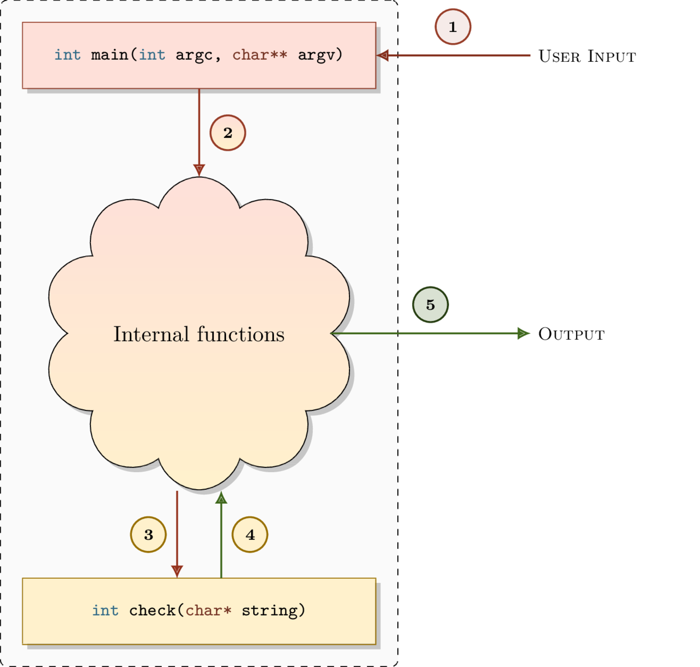
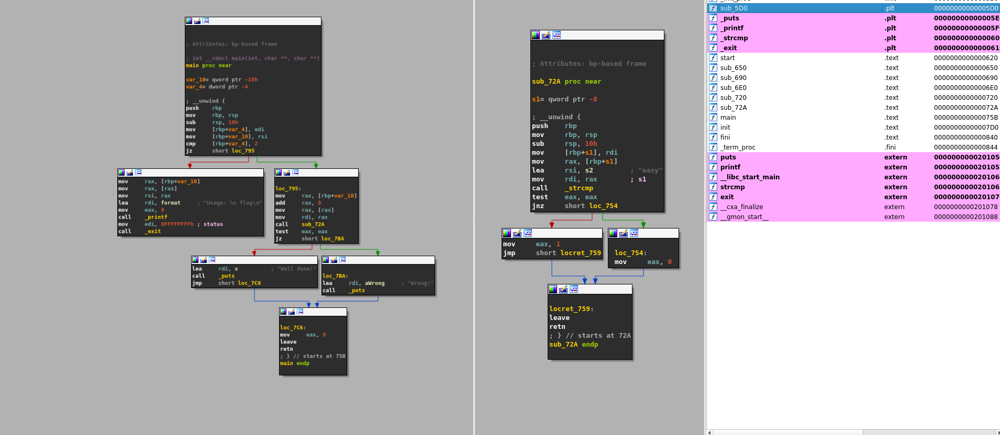
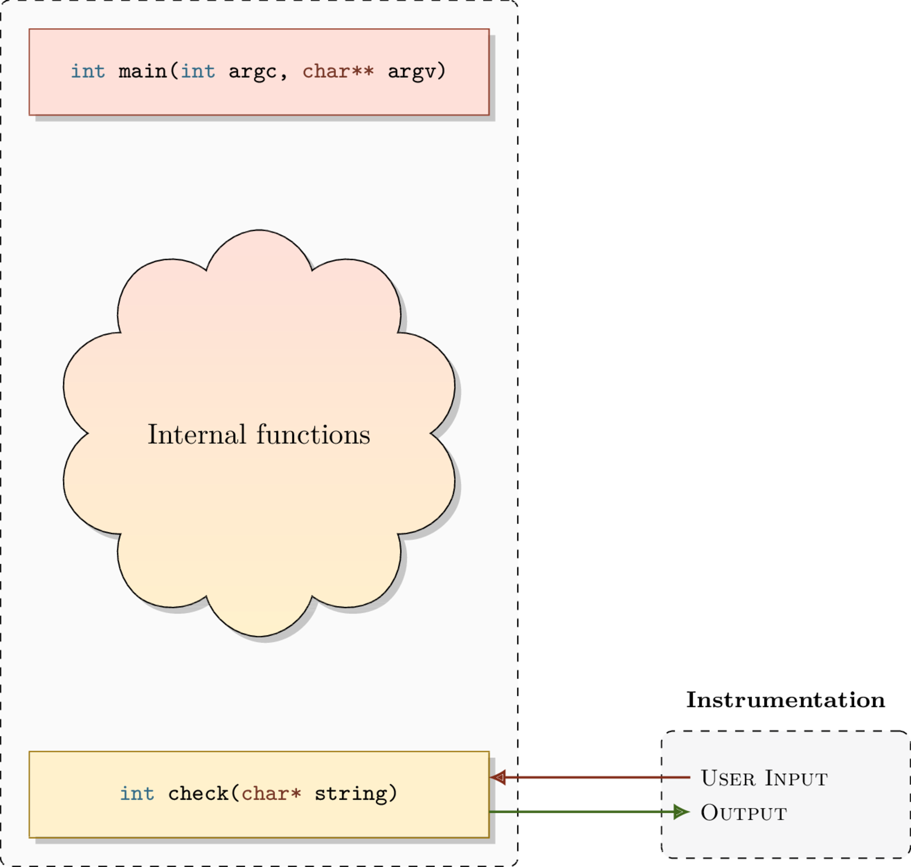

08 - Transforming an ELF executable into a library
--------------------------------------------------

In this tutorial, we will see how to convert a **PIE** executable into a library

Scripts and materials are available here: `materials <https://github.com/lief-project/tutorials/tree/master/08_ELF_bin2lib>`_

By Romain Thomas - `@rh0main <https://twitter.com/rh0main>`_ , updated by Adrien Guinet - `@adriengnt <https://twitter.com/adriengnt>`_

------

Introduction
~~~~~~~~~~~~

Actually, if we look at the header of a ELF PIE executable one can notice that it has the same type as a shared object (i.e. library)

.. code-block:: console

  $ readelf -h /usr/bin/ssh|grep Type
  Type:  DYN (Shared object file)

  $ readelf -h /usr/lib/libm.so|grep Type
  Type:  DYN (Shared object file)

Using LIEF we can access this information through the :attr:`~lief.ELF.Header.file_type` attribute

.. code-block:: python

  >>> libm = lief.parse("/usr/lib/libm.so.6")
  >>> print(libm.header.file_type)
  E_TYPE.DYNAMIC

  >>> ssh = lief.parse("/usr/bin/ssh")
  >>> print(ss.header.file_type)
  E_TYPE.DYNAMIC

The main difference between a PIE binaries and a shared libraries is how symbols are exported.

A shared library aims to expose functions so that executable can bind to it whereas executables shouldn't not expose functions [1]_

It's confirmed with the number of exported functions in the two different objects:

.. code-block:: python

  >>> print(len(libm.exported_functions))
  572
  >>> print(len(ssh.exported_functions))
  10

In this tutorial we will see how we can transform raw function addresses into exported functions associated with a symbol,
thus thus exposing internal functions of the executable.

Exporting functions
~~~~~~~~~~~~~~~~~~~

Such transformation can be useful if we found a function at a given address and want to instrument it (using ``dlopen``/``dlsym`` for example).
Once the target function is exported we can link it as we would do for a *normal* library.

For example in a fuzzing scenario if one identifies a function that is a parser, we can export it and then we can feed its inputs with AFL. Thus we cut the path from the normal entrypoint to reach the function.

Let's see how it works on a basic *crackme*:

.. code-block:: cpp

  #include <stdlib.h>
  #include <stdio.h>
  #include <string.h>

  #define NOINLINE __attribute__ ((noinline))

  NOINLINE int check_found(char* input) {
    if (strcmp(input, "easy") == 0) {
      return 1;
    }
    return 0;
  }

  int main(int argc, char** argv) {

    if (argc != 2) {
      printf("Usage: %s flag\n", argv[0]);
      exit(-1);
    }

    if (check_found(argv[1])) {
      printf("Well done!\n");
    } else {
      printf("Wrong!\n");
    }
    return 0;
  }

This code takes a string as input and call the ``check_found`` function on this
string, then it returns ``1`` if the input is ``easy``. ``0`` otherwise.

The ``__attribute__ ((noinline))`` is used to make sure the ``check_found``
function won't be inlined by the compiler.  Indeed, if the function check is
inlined, there won't be an address associated to this function.

This figure sump-up the execution flow:

The *crackme* can be compiled with:

.. code-block:: console

  $ gcc crackme101.c -O0 -fPIE -pie -Wl,-strip-all,--hash-style=sysv -o crackme101.bin -fvisibility=hidden
  $ ./crackme101.bin foo
  Wrong!
  $ ./crackme101.bin easy
  Well done!

Note the usage of the ``-fvisibility=hidden`` flag. It makes the compiler not
automatically export functions, like the ``check_found`` one. By opening
``crackme101.bin`` with LIEF, we can check that no functions are exported:

.. code-block:: python

  >>> import lief
  >>> crackme101 = lief.parse("./crackme101.bin")
  >>> print(len(crackme101.exported_functions))
  0

Using a disassembler we can quickly identify the check function address:

In this case, the **check** function is located at the address: ``0x72A`` [2]_

Now that we identified the address we can export it as a named function: ``check_found``

.. code-block:: python

  >>> crackme101.add_exported_function(0x72A, "check_found")
  >>> crackme101.write("libcrackme101.so")

And that all!

``libcrackme101.so`` is now a **library** that export one function: ``check_found``.

.. code-block:: python

  >>> import lief
  >>> libcrackme101 = lief.parse("./libcrackme101.so")
  >>> print(len(crackme101.exported_functions))
  1
  >>> print(crackme101.exported_functions[0])
  check_found

It turns out that ``libcrackme101.so`` is still an executable:

.. code-block:: console

  $ ./libcrackme101.so foo
  Wrong!
  $ ./libcrackme101.so easy
  Well done!

Since we have exported a function we can now use ``dlopen`` on ``libcrackme101.so`` and
``dlsym`` on ``check_found``

.. code-block:: cpp
  :emphasize-lines: 9,14

  #include <dlfcn.h>
  #include <stdio.h>
  #include <stdlib.h>

  typedef int(*check_t)(char*);

  int main (int argc, char** argv) {

    void* handler = dlopen("./libcrackme101.so", RTLD_LAZY);
    if (!handler) {
      fprintf(stderr, "dlopen error: %s\n", dlerror());
      return 1;
    }
    check_t check_found = (check_t)dlsym(handler, "check_found");

    int output = check_found(argv[1]);

    printf("Output of check_found('%s'): %d\n", argv[1], output);

    return 0;
  }

Running the code above should give a similar output:

.. code-block:: console

  $ gcc instrument.c -O0 -fPIE -pie -o instrument.bin -ldl
  $ ./instrument.bin test
  Output of check('test'): 0
  $ ./instrument.bin easy
  Output of check('easy'): 1

If ``dlopen`` returns an error, please read `the following section about glibc >= 2.29 <#glibc229>`_.

The transformation of the execution flow can be represented as follow:

.. _glic229:

Warning for glibc >= 2.29 users
~~~~~~~~~~~~~~~~~~~~~~~~~~~~~~~

If you are using ``glibc >= 2.29`` (or a close version depending on your Linux
distribution), you might have encountered this error while using the `dlopen`
function:

.. code::

 dlopen error: cannot dynamically load position-independent executable

Loading PIE binaries as shared libraries wasn't indeed really an intended use
case for ``dlopen``, and it used to work without really being properly
supported.  One of the reasons is that it `does not seem that trivial to
support <https://sourceware.org/bugzilla/show_bug.cgi?id=11754>`_ all the
possible use cases (issues with some relocations and ELF constructors).

These glibc versions now `implements a check
<https://patchwork.ozlabs.org/project/glibc/patch/20190312130235.8E82C89CE49C@oldenburg2.str.redhat.com/>`_
to deny calls to ``dlopen`` with PIE binaries. This is done by verifying the
``DF_1_PIE`` flag isn't present in the list of dynamic information flags.

In order to circumvent this test, LIEF can be used to remove this ``DF_1_PIE`` flag:

.. code-block:: python
  :emphasize-lines: 5

  import lief
  import sys
  path = sys.argv[1]
  bin_ = lief.parse(path)
  bin_[lief.ELF.DYNAMIC_TAGS.FLAGS_1].remove(lief.ELF.DYNAMIC_FLAGS_1.PIE)
  bin_.write(path + ".patched")

Conclusion
~~~~~~~~~~

Because PIE executables aim to be mapped at a random base address, they globally behave as a library. We only need to export the *interesting* functions.

For non-PIE executables such transformation would be very difficult because it requires to transform first
the executable into a *relocatable* executable. It means creating relocations, patching absolute *jump*, ...

LIEF only support this transformation for ELF and we need to investigate the PE and Mach-O cases [3]_.

.. rubric:: Notes

.. [1] Some functions can be exported by the linker such as ``_init``
.. [2] The mapped virtual address will be ``BASE + 0x72A`` where ``BASE`` is randomly choosed by the ASLR
.. [3] In OSX all executables are compiled with the PIE flag.

:API:

  * :meth:`lief.ELF.Binary.add_exported_function`
  * :meth:`lief.ELF.Binary.export_symbol`

  * :attr:`lief.ELF.Symbol.visibility`
  * :attr:`lief.ELF.Symbol.name`
  * :attr:`lief.ELF.Symbol.value`

