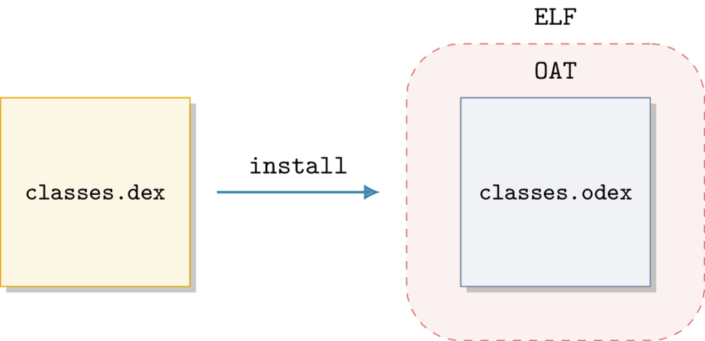
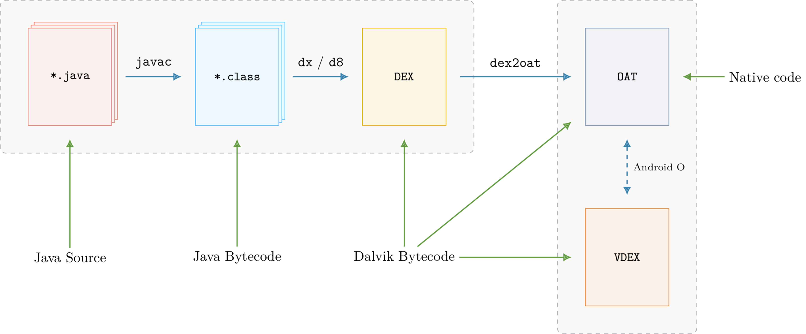

10 - Android formats
--------------------

This tutorial introduces Android formats as well as the API to use them. We are talking about DEX, OAT, VDEX and ART.

Files used in this tutorial are available on the `tutorials repository <https://github.com/lief-project/tutorials/tree/master/10_android_formats>`_

By Romain Thomas - `@rh0main <https://twitter.com/rh0main>`_

------

Introduction
~~~~~~~~~~~~

Let's start with a quick reminder about *compilation*, installation and the execution of Android applications.

When dealing with application development, the main part of the code is usually written in Java. Developers can also write native code (``C/C++``) through
the Java Native Interface (JNI) interface.

In the APK building process, the Java code is eventually transformed in the Dalvik bytecode which is interpreted by the Android Java virtual machine. The Android JVM is different from
the implementation by Oracle and, among the differences, it is based on registers whereas the one from Oracle is based on a stack.

To produce the Dalvik bytecode, Java sources are first compiled with ``javac`` into the Java bytecode and then Android transforms this
bytecode into the Dalvik one by using the ``dx`` compiler (or the new one: ``D8``). This bytecode is finally wrapped in a DEX file(s) such as ``classes.dex``. The DEX format is specific
to Android and the documentation is available `here <https://source.android.com/devices/tech/dalvik/dex-format>`_.

During the installation of the APK, the system applies optimizations on this DEX file in order to speed-up the execution. Indeed interpreting  bytecode is not as
efficient as executing native code and the Dalvik virtual machine is based on registers that are 32-bits width size whereas most of the recent CPU are 64-bits width.

To address this issue and prior to Android 4.4 (KitKat), the runtime used JIT compilation to transform Dalvik bytecode into assembly. The JIT ocurred **during the execution** and it was done
each time the application was executed. Since Android 4.4 they moved to a new runtime which, among other features, performs the optimizations **during the installation**.
Consequently the installation takes more time but transformations to native code are done once.

To optimize the Dalvik bytecode, the original DEX file (e.g. ``classes.dex``) is transformed into another file that will contain the native code. This new file usually has
the ``.odex``, ``.oat`` extension and is wrapped by the ELF format. Using ELF format makes sense for mainly two reasons:

- It's the default format used by Linux and Android to *package* assembly code.
- It enables to use the same loader: ``/system/bin/linker{64}``

OAT files are in fact ELF and this is why, we choose to add this new format in LIEF.
This ELF format is actually used as a wrapper over another format which is specific to Android: the OAT format.

Basically the ELF associated exports few symbols:

.. code-block:: python

  import lief

  oat = lief.parse("SomeOAT")
  for s in oat.dynamic_symbols:
    print(s)

.. code-block:: text

  oatdata                       OBJECT    GLOBAL    1000      1262000
  oatexec                       OBJECT    GLOBAL    1263000   10d4060
  oatlastword                   OBJECT    GLOBAL    233705c   4
  oatbss                        OBJECT    GLOBAL    2338000   f5050
  oatbsslastword                OBJECT    GLOBAL    242d04c   4

These symbols are a kind of pointers to specific part of the OAT format. For example, ``oatdata`` will point to the begining of the underlying OAT format whereas ``oatexec`` points
to the native code. For those who are interested in a deeper understand of OAT internal structures, See:

* `Hiding Behind ART  - Black Hat 2015 <https://www.blackhat.com/docs/asia-15/materials/asia-15-Sabanal-Hiding-Behind-ART-wp.pdf>`_
* `Dalvik and ART <http://newandroidbook.com/files/ArtOfDalvik.pdf>`_
* `OAT internal structures <http://romainthomas.fr/oat/>`_

These different formats can be a bit confusing and to summarize:

.. centered:: DEX are transformed into ``.odex`` files that are primarily ELF files wrapping a custom OAT format.

The structure of the OAT is poorly documented and its internal structures change for **each version** of Android without backward compatibility.
It means that OAT files produced on Android 6.0.1 can only be used on this version.

-------

In the Android framework the ``dex2oat`` executable is responsible to convert and optimize the APK DEX files into OATs. This executable is located in the
``/system/bin/`` directory and we can have its output through logcat:

.. code-block:: console

  $ adb logcat -s "dex2oat:I"
  ...
  05-04 10:16:37.218  1987  1987 I dex2oat : /system/bin/dex2oat --compiler-filter=speed --dex-file=/data/user/0/com.google.android.gms/snet/installed/snet.jar --oat-file=/data/user/0/com.google.android.gms/snet/dalvik-cache/snet.dex
  05-04 10:16:37.688  1987  1998 W dex2oat : Compilation of void com.google.android.snet.Snet.enterSnetIdle(android.content.Context, android.os.Bundle) took 116.995ms
  05-04 10:16:37.768  1987  1987 I dex2oat : ----------------------------------------------------
  05-04 10:16:37.768  1987  1987 I dex2oat : <SS>: S T A R T I N G . . .
  05-04 10:16:37.768  1987  1987 E dex2oat : <SS>: oat location is not valid /data/user/0/com.google.android.gms/snet/dalvik-cache/snet.dex
  05-04 10:16:37.768  1987  1987 I dex2oat : dex2oat took 552.045ms (threads: 8) arena alloc=3MB java alloc=1150KB native alloc=8MB free=3MB
  05-04 12:25:50.878 10460 10460 I dex2oat : /system/bin/dex2oat --compiler-filter=speed
  ...

The output above is the transformation of SaftyNet DEX files, located in ``/data/user/0/com.google.android.gms/snet/installed/snet.jar``, into an **OAT** saved in ``/data/user/0/com.google.android.gms/snet/dalvik-cache/snet.dex``.

One can notice that the extension is ``.dex`` so it should be a DEX file and not an OAT. Actually if we check the type:

.. code-block:: console

  $ file snet.dex
  snet.dex: ELF 64-bit LSB shared object, ARM aarch64, version 1 (GNU/Linux), dynamically linked, stripped

We can see an ELF.

.. warning::

  Do not trust extensions:
  **.dex** can be **DEX** or **OAT**, **.odex** are **OAT**, **.oat** are **OAT**, ...

The process of converting Java sources into the OAT can be simplified with the following diagram:

The Missing DEX
~~~~~~~~~~~~~~~

If we analyze applications from the Google PlayStore, we usually have the ``classes.dex`` file(s) in APK. As this file contains the Dalvik bytecode, most of the tools rely
on this file to perform the analysis (decompilation, static analysis, ...)

However when analyzing constructor firmwares (or ROM) these DEX files could miss. For example, if we are interested in ``com.android.settings`` from Samsung,
the application is associated with the ``/system/priv-app/SecSettings2`` directory which has the following structure:

.. code-block:: console

  $ tree system/priv-app/SecSettings2

  ├── oat
  │   └── arm64
  │       └── SecSettings2.odex
  └── SecSettings2.apk

  2 directories, 2 files

By looking at the files in ``SecSettings2.apk``, we can't find ``.dex`` files:

.. code-block:: console

  $ unzip -l ./SecSettings2.apk|grep -c "classes.dex"
  0

Next to the ``SecSettings2.apk``, we find ``SecSettings2.odex`` which is the OAT file resulting of the optimization of the missing DEX file.
As ROM developers control the Android **version** and the target architecture, they just have to provide the OAT file.

They can also use this *"feature"* to avoid analysis and reverse engineering of the application. As the Dalvik bytecode is located in the DEX file, without this file the analysis
is quite limited.

Thankfully there is a copy of the original DEX within the OAT! Actually it's not an exact copy as ``dex2oat`` replaces some Dalvik instructions (like ``invoke-virtual``) with optimized ones [1]_ but starting from **Android N**, we can also recover the original instructions.

Prior Android Oreo (8.0.0) DEX files were embedded in the OAT itself and after Oreo, the transformation performed by ``dex2oat`` generates two files:

- **classes.odex**: OAT containing native code
- **classes.vdex**: VDEX file containing copy of original DEX files

The DEX files originally located in the OAT has been exported **in a new file** with **a new format**: the VDEX format. This new format is completely
different from OAT, especially it's not an ELF.

In the same way as OAT format, VDEX internal structures change for each version of Android without backward compatibility.

It also exists tools [4]_ [5]_ [6]_ to extract DEX from OAT/VDEX files but the **extraction** [3]_ is either limited to OAT [4]_ or to VDEX [5]_. With LIEF we aim to provide a single framework to deal with these formats.

OAT and VDEX
~~~~~~~~~~~~

As explained in the previous part, internal structures of the formats change for each version of Android. LIEF provides an abstraction
of these modifications and the user can deal with OAT or VDEX without carrying of the underlying version of the OAT.

It currently supports OAT files from Android 6.0 Marshmallow (OAT v64) to Android 8.0.1 Oreo (OAT v131).

The OAT version is available with the :func:`lief.OAT.version` function:

.. code-block:: python

  >>> import lief
  >>> lief.OAT.version("classes.odex") # From Android 6
  64
  >>> lief.OAT.version("classes.odex") # From Android 7
  88

One can also access to the associated Android version by using :func:`lief.OAT.android_version`:

.. code-block:: python

  >>> lief.OAT.android_version(64)
  ANDROID_VERSIONS.VERSION_601
  >>> lief.OAT.android_version(124)
  ANDROID_VERSIONS.VERSION_800
  >>> lief.Android.code_name(lief.Android.ANDROID_VERSIONS.VERSION_800)
  'Oreo'
  >>> lief.Android.version_string(lief.Android.ANDROID_VERSIONS.VERSION_800)
  "8.0.0"

To express the fact that OAT files are first ELF, the :class:`lief.OAT.Binary` class extends the :class:`lief.ELF.Binary`

.. code-block:: python

  >>> import lief
  >>> oat = lief.parse("classes.odex")
  >>> type(oat)
  _pylief.OAT.Binary
  >>> isinstance(oat, lief.ELF.Binary)
  True

Thus the same ELF API is available: adding sections, modifying dynamic entries, etc and the :class:`lief.OAT.Binary` object adds the following methods:

.. autoclass:: lief.OAT.Binary
  :noindex:
  :members:
  :undoc-members:

If the given OAT targets Android Marshmallow or Nougat (6 or 7) then DEX files can be retrieved with the :attr:`lief.OAT.Binary.dex_files` attribute:

.. code-block:: python

  >>> len(oat.dex_files) # > 1 if multi-dex
  1
  >>> dex = oat.dex_files[0]
  >>> dex.save("/tmp/classes.dex")

From the code above, the :class:`lief.DEX.File` has been extracted to ``/tmp/classes.dex`` (with de-optimization).

If the given OAT targets Android Oreo or above, then extraction is done by using the VDEX file. The :func:`lief.OAT.parse` function accepts an OAT file or
an OAT **and** a VDEX file. By providing the VDEX file in the second parameter, the :class:`lief.OAT.Binary` object will have the same functionalities as the one for OAT pre-Oreo.

If the VDEX file is not provided then :class:`lief.OAT.Binary` will have limited information:

.. code-block:: python

  # Without VDEX file
  >>> oat_oreo = lief.parse("KeyChain.odex")
  >>> len(oat_oreo.dex_files)
  0
  >>> len(oat_oreo.classes)
  0
  >>> len(oat_oreo.oat_dex_files)
  1
  >>> oat_dex_file = oat_oreo.oat_dex_files[0]
  >>> print(oat_dex_file)
  /system/app/KeyChain/KeyChain.apk - (Checksum: 0x206c8ab1)

.. code-block:: python

  # With VDEX file
  >>> oat_oreo = lief.OAT.parse("KeyChain.odex", "KeyChain.vdex")
  >>> len(oat_oreo.dex_files)
  1
  >>> len(oat_oreo.classes)
  17
  >>> oat_oreo.dex_files[0].save("/tmp/classes.dex")

We can also use the LIEF's VDEX module directly:

.. code-block:: python

  >>> vdex = lief.VDEX.parse("KeyChain.vdex")

As the VDEX format is completely different from OAT, ELF, PE and Mach-O the VDEX parser creates a :class:`lief.VDEX.File` object and not a :class:`~lief.Binary`.
We can also extract DEX files with the  :attr:`lief.VDEX.File.dex_files` attribute:

.. code-block:: python

  >>> len(vdex.dex_files)
  1
  >>> vdex.dex_files[0].save("/tmp/KeyChain.dex") # With de-optimization

DEX
~~~

The previous part was about the OAT/VDEX formats and how to access to the underlying DEX. This part introduces the main API for the :class:`lief.DEX.File` object.

The LIEF DEX module enables to get information about Java code such as String, classes name, dalvik bytecodes, ...

.. note::

  As LIEF project is only focused on formats, there won't be Dalvik disassembler in the DEX module.

The main API for a DEX file is in the :class:`lief.DEX.File` object. This object can be generated using:

  * :attr:`lief.OAT.Binary.dex_files`
  * :attr:`lief.VDEX.File.dex_files`
  * :func:`lief.DEX.parse`

.. code-block:: python

  >>> oat = lief.parse("SecSettings2.odex")
  >>> type(oat.dex_files[0])
  _pylief.DEX.File

  >>> vdex = lief.VDEX.parse("SecSettings2.odex")
  >>> type(vdex.dex_files[0])
  _pylief.DEX.File

  >>> dex = lief.DEX.parse("classes.dex")
  >>> type(dex)
  _pylief.DEX.File

Once created, we can access to the strings with the :attr:`lief.DEX.File.strings` attribute:

.. code-block:: python

  >>> len(dex.strings)
  23529
  >>> for s in dex.strings:
  ...   if http in s:
  ...     print(s)

  https://analytics.mopub.com/i/jot/exchange_client_event
  https://app-measurement.com/a
  https://mobilecrashreporting.googleapis.com/v1/crashes:batchCreate?key=
  https://pagead2.googlesyndication.com/pagead/gen_204?id=gmob-apps
  https://plus.google.com/
  https://ssl.google-analytics.com
  https://support.google.com/dfp_premium/answer/7160685#push
  https://www.google.com
  ...

Similarly, methods and classes are available with the :attr:`lief.DEX.File.classes` / :attr:`lief.DEX.File.methods` attributes:

.. code-block:: python

  for cls in dex.classes:
    if cls.source_filename:
      print(cls)

.. code-block:: text

  com.avast.android.sdk.antitheft.internal.protection.wipe.a - CalendarWiper.java - 3 Methods
  com.avast.android.account.internal.identity.a - AvastIdentityProvider.java - 17 Methods
  com.avast.android.account.internal.identity.d - FacebookIdentityProvider.java - 19 Methods
  com.avast.android.lib.wifiscanner.internal.b$a - WifiScannerComponentFactory.java - 1 Methods

In the DEX file format, there is a special attribute for classes that register the original source filename: `source_file_idx <https://source.android.com/devices/tech/dalvik/dex-format#class-def-item>`_.
Some *obfuscators* mangle classes but keep this attribute! Since Java source filenames are associated with class names, we can easily recover the deobfuscated name using:

  * :attr:`lief.DEX.Class.source_filename`
  * :attr:`lief.DEX.Class.pretty_name`

.. code-block:: python

  for cls in dex.classes:
    if cls.source_filename:
      print(cls.pretty_name + ": ---> " + cls.source_filename)

.. code-block:: text

  com.avast.android.sdk.antitheft.internal.protection.wipe.a: ---> CalendarWiper.java
  com.avast.android.account.internal.identity.a               ---> AvastIdentityProvider.java
  com.avast.android.account.internal.identity.d               ---> FacebookIdentityProvider.java
  com.avast.android.lib.wifiscanner.internal.b$a              ---> WifiScannerComponentFactory.java

  If we are interested with DEX methods, they are represented with the :class:`~lief.DEX.Method` object and we can access to the **raw** Dalvik bytecode through :attr:`lief.DEX.Method.bytecode`

ART
~~~

**ART** is the name of the **Android Runtime** but it's also a **format**! This format is used for optimization purpose by the Android's **framework**.

As discussed previously, Android has its own implementation of the Java virtual based on the Dalvik bytecode.
This JVM is implemented in C++ and Java primitives (``java.lang.String``, ``java.lang.Object``, etc) are mirrored with C++ objects:

* ``java.lang.Class``: ``art::mirror::Class``
* ``java.lang.String``: ``art::mirror::String``
* ``java.lang.reflect.Method``: ``art::mirror::Method``
* ...

When instantiating a **new** Java class, it creates a mirrored C++ object (Memory allocation, calling constructors, ...) and the JVM handles a reference on this C++ object. To speed up the boot process and to avoid instantiation of well-known classes [2]_ at each boot, Android uses the ART format to store instances of C++ objects. To simplify, it can be seen as a heap dump of C++ objects.

In the same way as OAT and VDEX, the internal structures of this format change for each version of Android.

LIEF 0.9 has a very basic support for this format and only exposes the ART :class:`lief.ART.Header`. The main API is available in the :class:`lief.ART.File` object.

.. code-block:: python

  art = lief.ART.parse("boot.art")
  print(art.header)

.. code-block:: text

  Version:                         46
  Image Begin:                     0x70000000
  Image Size:                      0x238ac8
  Checksum:                        0x997c0fb0
  OAT File Begin:                  0x70a5b000
  OAT File End:                    0x71272000
  OAT Data Begin:                  0x70a5c000
  OAT Data End:                    0x7126df70
  Patch Delta:                     0
  Pointer Size:                    8
  Compile pic:                     true
  Number of sections:              10
  Number of methods:               7
  Boot Image Begin:                0
  Boot Image Size:                 0
  Boot OAT Begin:                  0
  Boot OAT Size:                   0
  Storage Mode:                    UNCOMPRESSED
  Data Size:                       0x2389f0

oatlastword
~~~~~~~~~~~

LIEF 0.9 is *read-only* on these formats but further versions should enable to modify them (Add methods, change names, patch checksum, ...)

Enjoy!

.. rubric:: Notes

.. [1] * http://mylifewithandroid.blogspot.com/2009/05/about-quick-method-invocation.html
       * https://github.com/JesusFreke/smali/wiki/UnresolvableOdexInstruction

.. [2] Usually the ones from the Android Framework

.. [3] They have other nices features like a disassembler, pseudo-code, ... that are not cover in LIEF

.. [4] Dextra by Jonathan Levin: http://newandroidbook.com/tools/dextra.html

.. [5] vdexExtractor by Anestis Bechtsoudis: https://github.com/anestisb/vdexExtractor

.. [6] smali by JesusFreke: https://github.com/JesusFreke/smali/wiki/DeodexInstructions

.. rubric:: API

* :class:`lief.OAT.Binary`
* :class:`lief.VDEX.File`
* :class:`lief.DEX.File`
* :class:`lief.ART.File`

