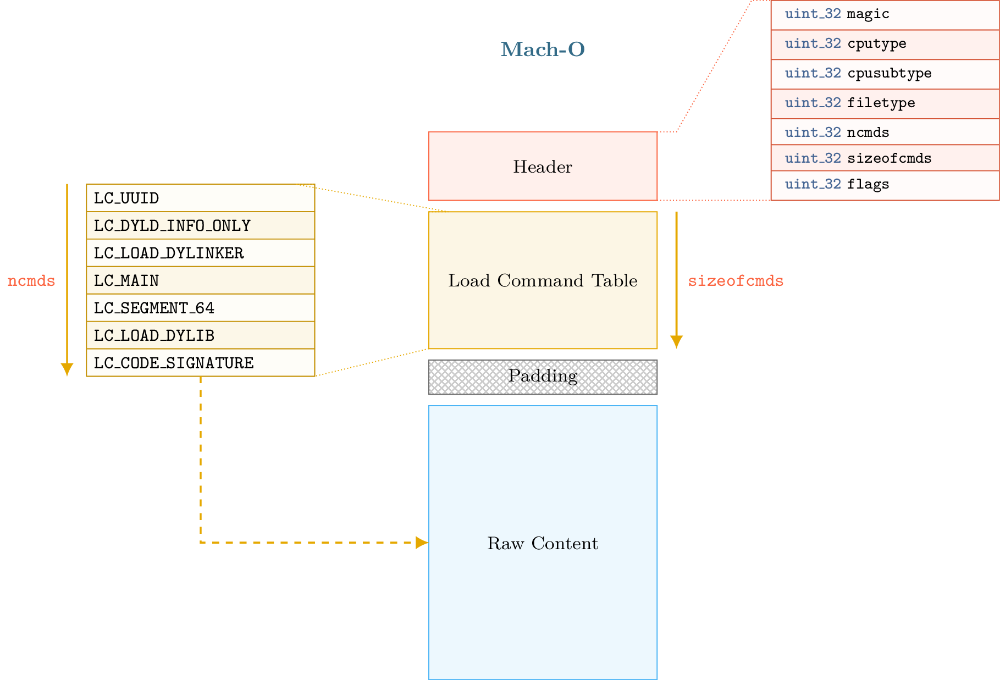
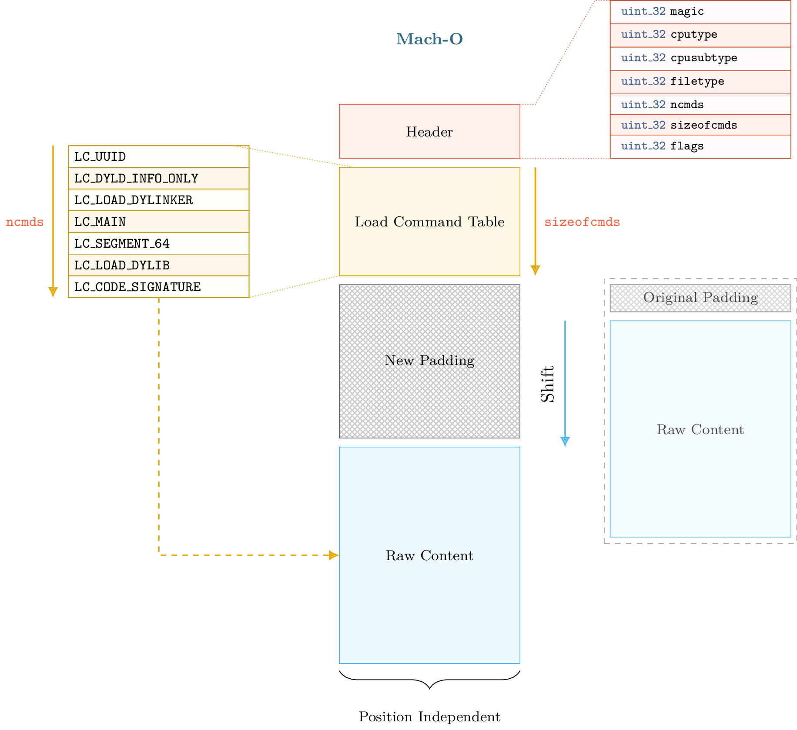
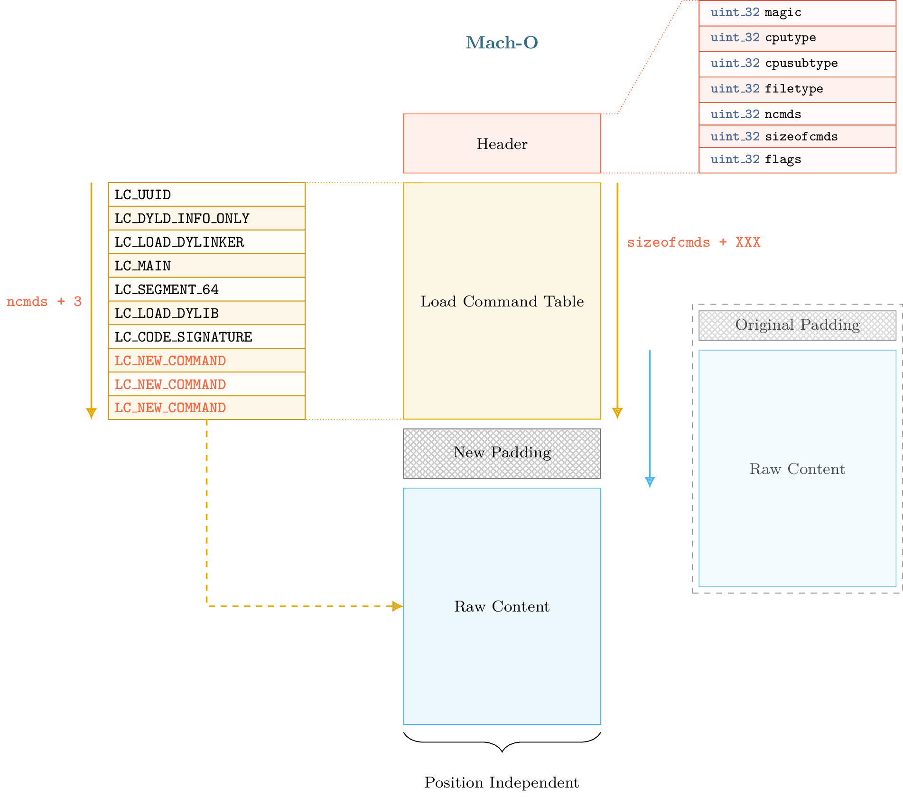
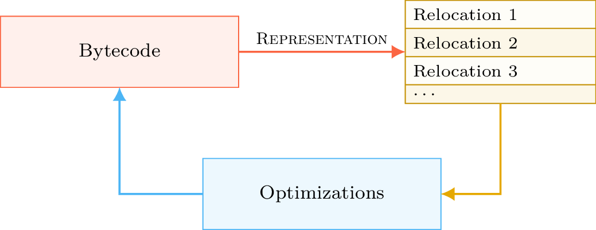
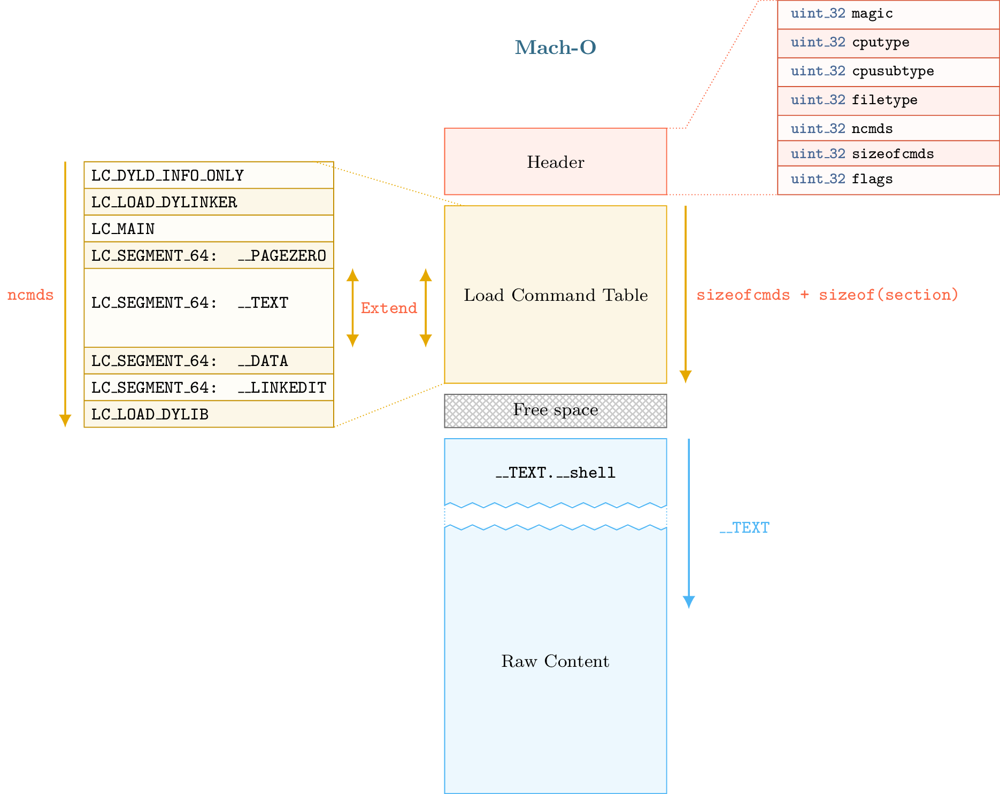

11 - Mach-O Modification
-------------------------

This tutorial deals with Mach-O format modification and introduces some internal aspects of the format.

Files and scripts used in this tutorial are available on the `tutorials repository <https://github.com/lief-project/tutorials/tree/master/11_macho_modification>`_

By Romain Thomas - `@rh0main <https://twitter.com/rh0main>`_

------

Introduction
~~~~~~~~~~~~

A basic Mach-O binary (i.e. not FAT) can be represented in fours parts that are described in this diagram:

The first part begins with a header that can be accessed through the :attr:`lief.MachO.Binary.header` attribute. In the second part, we have the load commands table which can be iterated using :attr:`lief.MachO.Binary.load_commands`
then, we can optionally have padding or free space. Finally, we have the raw data (assembly code, rebase bytecode, signature, ...)

Load commands like :class:`~lief.MachO.SegmentCommand` or :class:`~lief.MachO.DyldInfo` can be associated with *raw data* that are located after the load command table and the padding section.
The padding section is used by OSX to sign the binary after the compilation by adding a custom command. The ``codesign`` utility extends the *raw data* area with the signature and adds a ``LC_CODE_SIGNATURE`` or a ``LC_DYLIB_CODE_SIGN_DRS`` command in the padding area.

Since load commands are the base unit of the Mach-O format -- segments, shared libraries, entry point, etc are somehow *commands* -- being able to add arbitrary commands in a binary
enables interesting like code injection, anti-analysis, ...

Different techniques exist to add new command in a Mach-O binary:

* One can replace an existing load command that is not mandatory for the execution like :class:`~lief.MachO.UUIDCommand` or :class:`~lief.MachO.CodeSignature`.
* One can use the padding area add to the command header.

The main limitation of these techniques is that the size and the number of commands that can be added are tied to the padding section size or to the size of the command replaced.

If the padding size is tiny, we can't add a ``LOAD_DYLIB`` command with a *very long* library path. Moreover ``codesign`` may complain that there are not enough spaces to add the ``LC_CODE_SIGNATURE`` since we are using the space that was reserved for it.

Next parts are about format modifications and how we managed to address this limitation.

When PIE makes thing easier
~~~~~~~~~~~~~~~~~~~~~~~~~~~

OSX and iOS executables are by default compiled with flags that make them position independent. Instructions generated by the compiler will use
relative addressing associated with *rebase* information.

To simplify (not accurate), PIE binaries enable to *map* the raw data section at a random base address.
The idea that is implemented in LIEF is that raw data section can be mapped at a random base address so it can also be shifted within the format.

Such transformation also requires to keep a consistent state of the format metadata. Especially, when we shift the raw data we need to update relocations, segment offsets, virtual address, etc. Once the raw data shifted and
the metadata updated, we have an arbitrary space between the load command table and the raw data section. Thus we can extend the load command table as shown in figure below:

.. warning::

  The size of the shift must be aligned on a page size to avoid issues with section and segment alignments.

Keeping the format consistency after the shift transformation is not easy. The next part presents some parts of the Mach-O format that need to be updated in order to keep the consistency.

When Mach-O makes thing harder
~~~~~~~~~~~~~~~~~~~~~~~~~~~~~~

After the shift operation, we need to update several load commands of the Mach-O format:

* :attr:`lief.MachO.SymbolCommand.symbol_offset` / :attr:`lief.MachO.SymbolCommand.strings_offset`
* :attr:`lief.MachO.DataInCode.data_offset`, :attr:`lief.MachO.CodeSignature.data_offset`, :attr:`lief.MachO.SegmentSplitInfo.data_offset`
* :attr:`lief.MachO.MainCommand.entrypoint`
* :attr:`lief.MachO.FunctionStarts.data_offset` / :attr:`lief.MachO.FunctionStarts.functions`
* :class:`~lief.MachO.DynamicSymbolCommand`
* :attr:`lief.MachO.Section.offset` / :attr:`lief.MachO.Section.virtual_address`
* :attr:`lief.MachO.SegmentCommand.offset` / :attr:`lief.MachO.SegmentCommand.virtual_address`
* ...

We also need to update:

* Relocations
* Binding information
* Export information

Whereas ELF and PE formats use some kinds of ``struct`` for internal storage of relocations and exports, Mach-O format uses a bytecode to *rebase* the binary. Export information are stored in a  `trie <https://en.wikipedia.org/wiki/Trie>`_ data structure. The use of trie and bytecode reduces the binary size but it makes the update more difficult as we need to interpret and regenerate the bytecode.

Rebase bytecode
***************

As mentioned in the previous part, recent Mach-O loader uses a bytecode to relocate (or rebase) the binary.
Offset and size of the bytecode are given in :attr:`lief.MachO.DyldInfo.rebase` attribute. Basically, bytecode is compound of :class:`~lief.MachO.REBASE_OPCODES` that define addresses to relocate.

.. warning::

  One can notice that :class:`~lief.MachO.Section` object has a :attr:`~lief.MachO.Section.relocation_offset` attribute. Actually, it seems to be only
  used for Mach-O object files (:attr:`lief.MachO.FILE_TYPES.OBJECT`) or with an executable that uses an old version of the Mach-O loader.

  This offset points to a list of relocation structures (not bytecode) for which the number is defined by :attr:`~lief.MachO.Section.numberof_relocations`.

To know which addresses need to be relocated, we have to interpret the bytecode.

The :attr:`lief.MachO.DyldInfo.show_rebases_opcodes` attribute returns the bytecode as *pseudo code*:

.. code-block:: python

  import lief
  app = lief.parse("MachO64_x86-64_binary_id.bin")
  print(app.dyld_info.show_rebases_opcodes)

.. code-block:: text

  [SET_TYPE_IMM] Type: POINTER
  [SET_SEGMENT_AND_OFFSET_ULEB] Segment Index := 2 (__DATA) Segment Offset := 0x20
  [DO_REBASE_ULEB_TIMES]
    for i in range(26):
        rebase(POINTER, __DATA, 0x20)
        Segment Offset += 0x8 (0x28)

        rebase(POINTER, __DATA, 0x28)
        Segment Offset += 0x8 (0x30)

        rebase(POINTER, __DATA, 0x30)
        Segment Offset += 0x8 (0x38)

        rebase(POINTER, __DATA, 0x38)
        Segment Offset += 0x8 (0x40)

        rebase(POINTER, __DATA, 0x40)
        Segment Offset += 0x8 (0x48)
        ...
  [DONE]

From the above output, we can see that the loader will rebase **pointer** in the ``__DATA`` segment at offset ``0x20, 0x28, 0x38, ...``.

For those who only care about which exact addresses are relocated, this output is not very user-friendly. LIEF also provides a **representation** of this bytecode by creating :class:`lief.MachO.Relocation` object.
They are the result of the **interpretation** of the bytecode.

The :attr:`lief.MachO.Binary.relocations` attribute returns an iterator over :class:`lief.MachO.Relocation` objects that **model** a relocation in a similar object as :class:`lief.ELF.Relocation` and :class:`lief.PE.Relocation`.

.. code-block:: python

  for relocation in app.relocations:
    print(relocation)

.. code-block:: text

  100002020 POINTER 64 DYLDINFO  __DATA.__la_symbol_ptr _err
  100002028 POINTER 64 DYLDINFO  __DATA.__la_symbol_ptr _errx
  100002030 POINTER 64 DYLDINFO  __DATA.__la_symbol_ptr _exit
  100002038 POINTER 64 DYLDINFO  __DATA.__la_symbol_ptr _fprintf
  100002040 POINTER 64 DYLDINFO  __DATA.__la_symbol_ptr _free
  100002048 POINTER 64 DYLDINFO  __DATA.__la_symbol_ptr _fwrite
  ...

Using this representation, we can update relocations by adding the shift size to the :attr:`lief.MachO.Relocation.address` attribute.

When the Mach-O builder reconstructs the final binary, it **regenerates** and optimize the rebase bytecode
according to the current state of the relocations. The process can be summed up with the following diagram:

Binding bytecode
****************

The Mach-O loader also uses a bytecode to bind imported functions or imported symbols. Actually, this bytecode is used in three different binding methods:

* Normal binding
* Weak binding -- Used when the same symbol is defined multiple times
* Lazy binding -- Bound only when there is an access to the symbol

The bytecode can be pretty printed with the :attr:`~lief.MachO.DyldInfo.show_bind_opcodes`, :attr:`~lief.MachO.DyldInfo.show_weak_bind_opcodes` and :attr:`~lief.MachO.DyldInfo.show_lazy_bind_opcodes`:

.. code-block:: python

  print(app.dyld_info.show_bind_opcodes)

.. code-block:: text

  [SET_DYLIB_ORDINAL_IMM]
      Library Ordinal := 1
  [SET_SYMBOL_TRAILING_FLAGS_IMM]
      Symbol name := ___stderrp
      Is Weak ? false
  [SET_TYPE_IMM]
      Type := POINTER
  [SET_SEGMENT_AND_OFFSET_ULEB]
      Segment := __DATA
      Segment Offset := 0x10
  [DO_BIND]
      bind(POINTER, __DATA, 0x10, ___stderrp, library_ordinal=/usr/lib/libSystem.B.dylib, addend=0, is_weak_import=false)
      Segment Offset += 0x8 (0x18)

The representation and the update process is the same as the one described in the section about *Rebase bytecode*

Export Trie
***********

Regarding exported functions and exported symbols, Mach-O format uses a *trie* structure to store export information. Trie offset and size are given in the :attr:`~lief.MachO.DyldInfo.export_trie` attribute.

Once parsed, trie entries are represented through the :class:`~lief.MachO.ExportInfo` object and can be retrieved with the :attr:`~lief.MachO.Symbol.export_info` attribute.

.. code-block:: python

  app = lief.parse("FAT_MachO_x86_x86-64_library_libdyld.dylib")
  print(app.dyld_info.show_export_trie)

.. code-block:: text

    ...
    _@off.0x17
        _N@off.0x21
            _NS@off.0x50
                _NSI@off.0x5d
                    _NSInstallLinkEditErrorHandlers@off.0x11d
                    _NSInstallLinkEditErrorHandlers{addr: 0x126b, flags: 0}
    ...

.. code-block:: python

  for s in app.symbols:
    if s.has_export_info:
      print(s.export_info)

.. code-block:: text

  Node Offset: 128
  Flags:       0
  Address:     126b
  Symbol:      _NSInstallLinkEditErrorHandlers

  Node Offset: 5f6
  Flags:       0
  Address:     2168
  Symbol:      _NSIsSymbolDefinedInObjectFileImage

  Node Offset: 1a0
  Flags:       0
  Address:     1391
  Symbol:      _NSIsSymbolNameDefined
  ...

After the shift operation, export information are patched by updating the :attr:`~lief.MachO.ExportInfo.address` attribute, then a new export trie is generated from the previous updates.

Removing signature
~~~~~~~~~~~~~~~~~~

Removing the ``LC_CODE_SIGNATURE`` command is a basic modification that is pretty useful when modifying Mach-O file. Since the signature
checks the integrity of the binary, we usually need to remove this command after modification on the file. We can still re-sign the binary once all modifications finished.

LIEF provides the :meth:`lief.MachO.Binary.remove_signature` function to remove this command:

.. code-block:: python

  ssh = lief.parse("/usr/bin/ssh")

  ssh.remove_signature()

  ssh.write("ssh.nosigned")

Code Injection with shared libraries
~~~~~~~~~~~~~~~~~~~~~~~~~~~~~~~~~~~~

As explained in the talk about format modification [1]_, one way to inject code within the memory space of a program is to force the loader to load a library (that was not previously linked) that contains a constructor function.

For a Mach-O binary, it can be achieved by adding one of these load commands:

* :attr:`~lief.MachO.LOAD_COMMAND_TYPES.ID_DYLIB`
* :attr:`~lief.MachO.LOAD_COMMAND_TYPES.LOAD_DYLIB`
* ...

Let's take an example with ``clang``. First, we need to create a tiny library which defines a constructor:

.. code-block:: cpp

  #include <stdio.h>
  #include <stdlib.h>

  __attribute__((constructor))
  void my_constructor(void) {
    printf("Hello World\n");
  }

Which is complied with

.. code-block:: console

  $ clang -fPIC -shared libexample.c -o libexample.dylib

Then we add a new :attr:`~lief.MachO.LOAD_COMMAND_TYPES.LOAD_DYLIB` using the :meth:`lief.MachO.Binary.add_library` function:

.. code-block:: python

  import lief
  clang = lief.parse("/usr/bin/clang")

  clang.add_library("/Users/romain/libexample.dylib")

  clang.write("/tmp/clang.new")

Finally, we run ``clang.new`` and see that ``Hello World`` is printed before the main execution of clang:

.. code-block:: console

  $ chmod u+x /tmp/clang.new

  $ /tmp/clang.new
  Hello World
  clang: error: no input files

We can also observe the new :attr:`~lief.MachO.LOAD_COMMAND_TYPES.LOAD_DYLIB` command with otool:

.. code-block:: console

  $ otool -l /tmp/clang.new|grep -C4 LOAD_DYLIB

  ...
  cmdsize 16
  dataoff 73864
  datasize 0
  Load command 16
          cmd LC_LOAD_DYLIB
      cmdsize 56
         name /Users/romain/libexample.dylib (offset 24)
   time stamp 2 Thu Jan  1 01:00:02 1970
      current version 0.0.0

Adding Section/Segment
~~~~~~~~~~~~~~~~~~~~~~

As we can allocate arbitrary space between the load command table and the raw data, we can also extend an existing :class:`~lief.MachO.LoadCommand`.
Especially, Mach-O segments are commands that are associated with the LIEF object :class:`lief.MachO.SegmentCommand`.

To add a new section in the ``__TEXT`` segment, we must extend the load command associated with this segment so that we can add a new section structure. We must also reserve space for the content of the section.
As the content of the ``__TEXT`` segment begin at offset 0 and finish somewhere in the raw data, the right place to insert the new content is between the end of the load command table and the beginning of the raw data:

The process described above is implemented through the :meth:`lief.MachO.Binary.add_section` method.

Here is an example in which we will inject assembly code that executes ``/bin/sh``:

.. code-block:: python

  app = lief.parse("MachO64_x86-64_binary_id.bin")

  raw_shell = [...] # Assembly code
  section = lief.MachO.Section("__shell", raw_shell)

  section.alignment = 2
  section += lief.MachO.SECTION_FLAGS.SOME_INSTRUCTIONS
  section += lief.MachO.SECTION_FLAGS.PURE_INSTRUCTIONS

  section = app.add_section(section)
  print(section)

Then we can change the entry point by setting the :attr:`lief.MachO.MainCommand.entrypoint` attribute:

.. code-block:: python

  __TEXT = app.get_segment("__TEXT")
  app.main_command.entrypoint = section.virtual_address - __TEXT.virtual_address

Finally, we remove the signature and reconstruct the binary:

.. code-block:: python

  app.remove_signature()
  app.write("./id.modified")

The execution of ``id.modified`` should give a similar output:

.. code-block:: console

  Mac-mini:tmp romain$ ./id.modified
  tmp @ [romain] $

You can also check other tools such as optool [2]_ or insert_dylib [3]_

.. rubric:: References

.. [1] http://romainthomas.fr/slides/18-06-Recon18-Formats-Instrumentation.pdf

.. [2] https://github.com/alexzielenski/optool

.. [3] https://github.com/Tyilo/insert_dylib

.. rubric:: API

* :meth:`lief.MachO.Binary.add_section`
* :meth:`lief.MachO.Binary.add_library`

