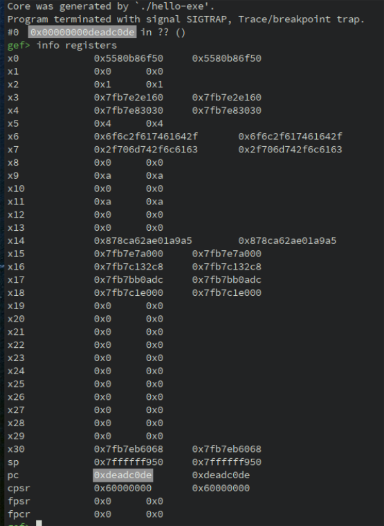

12 - ELF Coredump
-----------------

This tutorial introduces the API to analyze and manipulate ELF coredump

Files and scripts used in this tutorial are available on the `tutorials repository <https://github.com/lief-project/tutorials/tree/master/12_elf_coredump>`_

------

Introduction
~~~~~~~~~~~~

ELF core [1]_ files provide information about the CPU state and the memory state of a program when the coredump
has been generated. The memory state embeds
a *snapshot* of all segments mapped in the memory space of the program. The CPU state contains register values
when the core dump has been generated.

Coredump files use a subset of the ELF structures to register these information. **Segments** are used for
the memory state of the process while ELF notes (:class:`lief.ELF.Note`) are used for process metadata (pid, signal, ...)
Especially, the CPU state is stored in a note with a special type.

Here is an overview of coredump layout :

.. figure:: ../_static/tutorial/12/elf_notes.png
  :align: center

For more details about coredump internal structure, one can look at the following blog post: `Anatomy of an ELF core file <https://www.gabriel.urdhr.fr/2015/05/29/core-file/>`_

Coredump Analysis
~~~~~~~~~~~~~~~~~

As corefiles are effectively ELF, we can open these files using the :func:`lief.parse` function:

.. code-block:: python

   import lief

   core = lief.parse("ELF64_AArch64_core_hello.core")

We can iterate over the :class:`~lief.ELF.Segment` objects to inspect the memory state of the program:

.. code-block:: python

   segments = core.segments
   print("Number of segments {}".format(len(segments)))

   for segment in segments:
      print(hex(segment.virtual_address))

To resolve the relationship between libraries and segments, we can look at the special note :class:`lief.ELF.CoreFile`:

.. code-block:: python

   note_file = [n for n in core.notes if n.type_core == lief.ELF.NOTE_TYPES_CORE.FILE]
   assert len(note_file) == 1

   note_file = note_file.pop()

.. warning::

   Due to enum conflict between :class:`lief.ELF.NOTE_TYPES` and :class:`lief.ELF.NOTE_TYPES_CORE`,
   scripts must use :attr:`lief.ELF.Note.type_core` on ELF corefile instead of :attr:`lief.ELF.Note.type`

The ``note_file`` variable is basically an object :class:`lief.ELF.Note` on which the attribute
:attr:`lief.ELF.Note.details` can be access to have the underlying specialization of the note.
In the case of a note type :attr:`lief.ELF.NOTE_TYPES_CORE.FILE`, the attribute :attr:`~lief.ELF.Note.details` returns an
instance of :class:`lief.ELF.CoreFile`.

.. note::

   All note details inherit from the base class :class:`lief.ELF.NoteDetails` (or :cpp:class:`LIEF::ELF::NoteDetails`)

   Especially, in C++ we must downcast the reference returned by :cpp:func:`LIEF::ELF::Note::details`:

   .. code-block:: cpp

      note = ...
      // Check Type
      // ...
      const auto& note_file = reinterpret_cast<const CoreFile&>(note.details());

We can eventually use the attribute :attr:`lief.ELF.CoreFile.files` or directly iterate on
the :class:`lief.ELF.CoreFile` object. Both give access to the :class:`lief.ELF.CoreFileEntry`: objects

.. code-block:: python

   for file_entry in note_file:
      print(file_entry)

.. code-block:: text

   /data/local/tmp/hello-exe: [0x5580b86000, 0x5580b88000]@0
   /data/local/tmp/hello-exe: [0x5580b97000, 0x5580b98000]@0x1000
   /data/local/tmp/hello-exe: [0x5580b98000, 0x5580b99000]@0x2000
   /system/lib64/libcutils.so: [0x7fb7593000, 0x7fb7595000]@0xf000
   /system/lib64/libcutils.so: [0x7fb7595000, 0x7fb7596000]@0x11000
   /system/lib64/libnetd_client.so: [0x7fb75fb000, 0x7fb75fc000]@0x2000
   /system/lib64/libnetd_client.so: [0x7fb75fc000, 0x7fb75fd000]@0x3000
   /system/lib64/libdl.so: [0x7fb7a2e000, 0x7fb7a2f000]@0x1000
   /system/lib64/libdl.so: [0x7fb7a2f000, 0x7fb7a30000]@0x2000
   /data/local/tmp/liblibhello.so: [0x7fb7b22000, 0x7fb7b2a000]@0xcb000
   /data/local/tmp/liblibhello.so: [0x7fb7b2a000, 0x7fb7b2b000]@0xd3000
   /system/lib64/libc.so: [0x7fb7c0e000, 0x7fb7c14000]@0xc5000
   /system/lib64/libc.so: [0x7fb7c14000, 0x7fb7c16000]@0xcb000
   /system/lib64/liblog.so: [0x7fb7c6c000, 0x7fb7c6d000]@0x16000
   /system/lib64/liblog.so: [0x7fb7c6d000, 0x7fb7c6e000]@0x17000
   /system/lib64/libc++.so: [0x7fb7d6f000, 0x7fb7d77000]@0xe2000
   /system/lib64/libc++.so: [0x7fb7d77000, 0x7fb7d78000]@0xea000
   /system/lib64/libm.so: [0x7fb7db8000, 0x7fb7db9000]@0x36000
   /system/lib64/libm.so: [0x7fb7db9000, 0x7fb7dba000]@0x37000
   /system/bin/linker64: [0x7fb7e93000, 0x7fb7f87000]@0
   /system/bin/linker64: [0x7fb7f88000, 0x7fb7f8c000]@0xf4000
   /system/bin/linker64: [0x7fb7f8c000, 0x7fb7f8d000]@0xf8000

From this output, we can see that the :class:`~lief.ELF.Segment` of the main executable
(``/data/local/tmp/hello-exe``), are mapped from address ``0x5580b86000`` to address ``0x5580b99000``.

One can also access to the registers state by using the note for which the :attr:`~lief.ELF.Note.type_core`
is :class:`lief.ELF.CorePrStatus`.

.. code-block:: python

   for note in core.notes:
      if note.type_core == lief.ELF.NOTE_TYPES_CORE.PRSTATUS:
         details = note.details
         print(details)

         # Print instruction pointer
         print(hex(details[lief.ELF.CorePrStatus.REGISTERS.AARCH64_PC]))
         # or
         print(hex(details.get(lief.ELF.CorePrStatus.REGISTERS.AARCH64_PC)))

.. code-block:: text

   0x5580b86f50
   0x5580b86f50

Coredump manipulation
~~~~~~~~~~~~~~~~~~~~~

LIEF enables, to a certain extent, to modify coredump. For instance,
we can update the register values as follows:

.. code-block:: python

   note_prstatus = [n for n in core.notes if n.type_core == lief.ELF.NOTE_TYPES_CORE.PRSTATUS][0]
   note_prstatus.details[lief.ELF.CorePrStatus.REGISTERS.AARCH64_PC] = 0xDEADC0DE

   core.write("/tmp/new.core")

When opening ``/tmp/new.core`` in GDB, we can observe the modification:

Final word
~~~~~~~~~~

One advantage of the coredump over the raw binary
is that **relocations** and **dependencies** are resolved inside the coredump.

This API could be used in association with other tools. For instance, we could use `Triton <https://triton.quarkslab.com/>`_ API:

- `AArch64Cpu::setConcreteRegisterValue() <https://triton.quarkslab.com/documentation/doxygen/classtriton_1_1arch_1_1arm_1_1aarch64_1_1AArch64Cpu.html>`_
- `AArch64Cpu::setConcreteMemoryAreaValue() <https://triton.quarkslab.com/documentation/doxygen/classtriton_1_1arch_1_1arm_1_1aarch64_1_1AArch64Cpu.html>`_

to map the coredump in Triton and then use its engines: Taint analysis, symbolic execution.

.. rubric:: References

.. [1] https://www.gabriel.urdhr.fr/2015/05/29/core-file/

.. rubric:: API

* :func:`lief.parse`
* :attr:`lief.ELF.Note.details`

* :class:`lief.ELF.CorePrPsInfo`
* :class:`lief.ELF.CorePrStatus`
* :class:`lief.ELF.CoreFile`
* :class:`lief.ELF.CoreFileEntry`
* :class:`lief.ELF.CoreSigInfo`
* :class:`lief.ELF.CoreAuxv`

